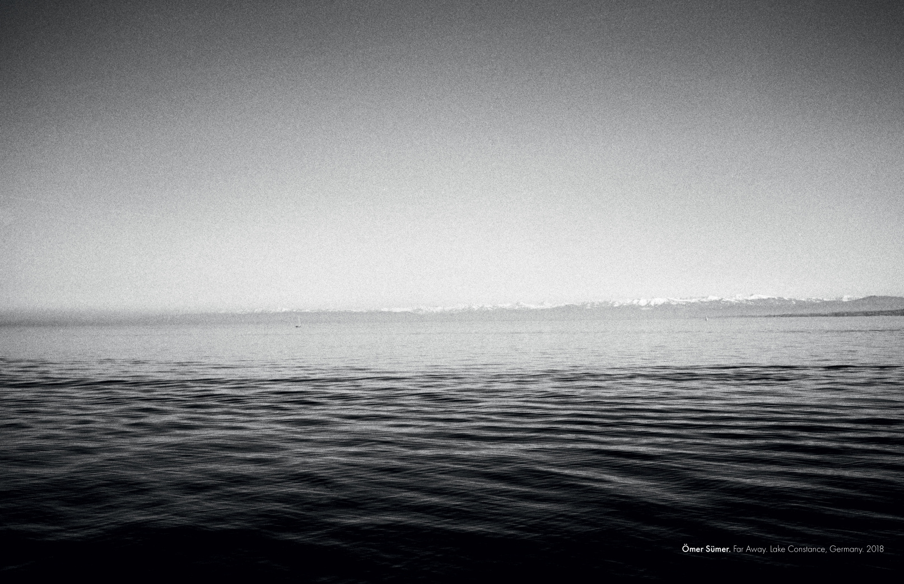

I'm an AI/ML researcher and engineer based in Heidelberg, Germany.

I've spent over a decade in computer vision and machine learning, from analyzing students' engagement and behavior during my PhD at the University of Tübingen, to building AI diagnostics for rare genetic diseases at the University of Augsburg, and more recently working on medical image analysis and LLM-based clinical text processing at the German Cancer Research Center (DKFZ). What drives me across all these domains is applied ML itself: talking to field experts to understand their problem, working with messy real-world data, and building systems that actually solve it.

Outside of research, I enjoy analog photography and develop my films at home. I hike across borders in the Alps, am slowly learning to climb, and write columns for [Manifold](https://www.manifold.press/indeks/omer-sumer) on AI and the humanities in Turkish.

<nav class="socials" aria-label="Social media links" style="display: flex; gap: 1.0rem;">
  <a href="mailto:suemer.oemer@outlook.com" class="social-card email" target="_blank">
    <i class="bi bi-envelope-fill"></i> E-mail
  </a>
  <a href="https://github.com/sumeromer" class="social-card github" target="_blank">
    <i class="bi bi-github"></i> GitHub
  </a>
  <a href="https://www.linkedin.com/in/omer-sumer" class="social-card linkedin" target="_blank">
    <i class="bi bi-linkedin"></i> LinkedIn
  </a>
  <a href="https://scholar.google.com/citations?hl=en&user=h5sbUygAAAAJ&view_op=list_works&sortby=pubdate" class="social-card scholar" target="_blank">
    <i class="bi bi-google"></i> Scholar
  </a>
</nav>

#### **Academic Background**

  **Eberhard Karls University of Tübingen**, Germany  
PhD in Computer Science (magna cum laude). *August 2017 - March 2021*  
[Multimodal Visual Sensing: Automated Estimation of Engagement](https://publikationen.uni-tuebingen.de/xmlui/handle/10900/113627)

  **Istanbul Technical University**, Istanbul, Turkey  
M.Sc. in Electronics Engineering. *July 2012 - September 2014*  

  **Naval Academy**, Istanbul, Turkey  
B.Sc. in Electronics Engineering.  *July 2006 - August 2010*  

---

  
    <figcaption style="color: gray; font-style: italic;">
      Ömer Sümer. Far Away. Lake Constance, Germany (maybe. magazine)  
      Kodak Tri-X 400, push processing@800
  </figcaption>

