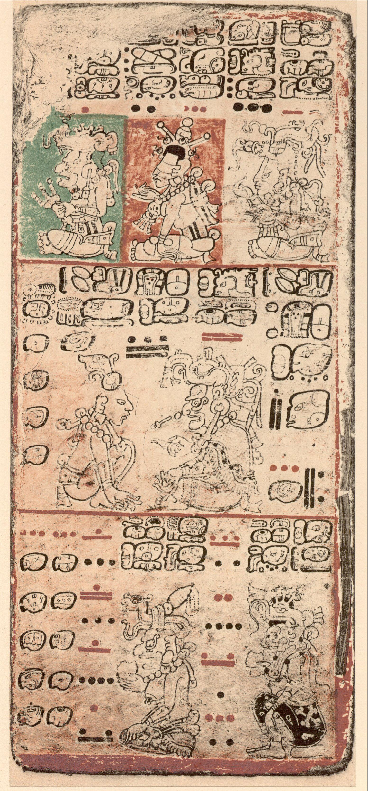
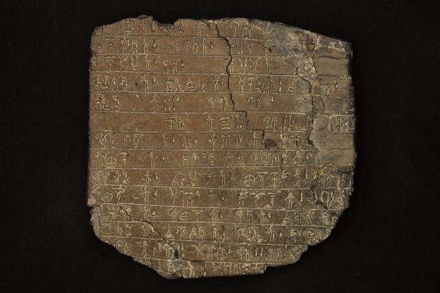
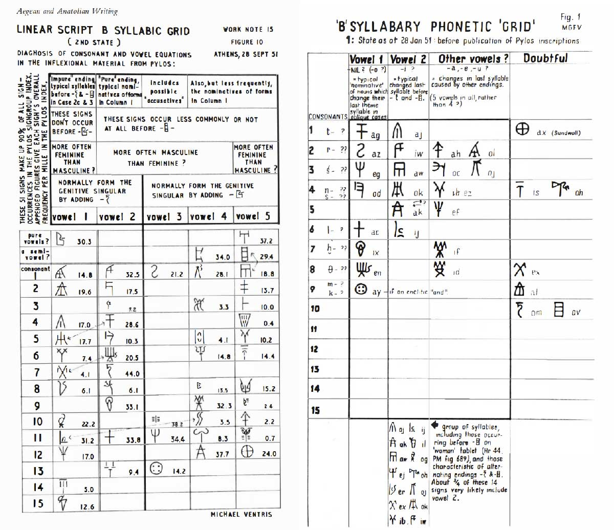
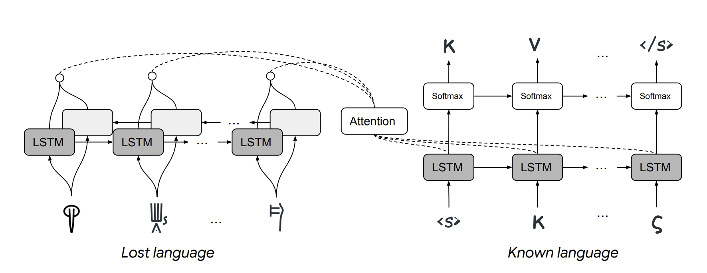
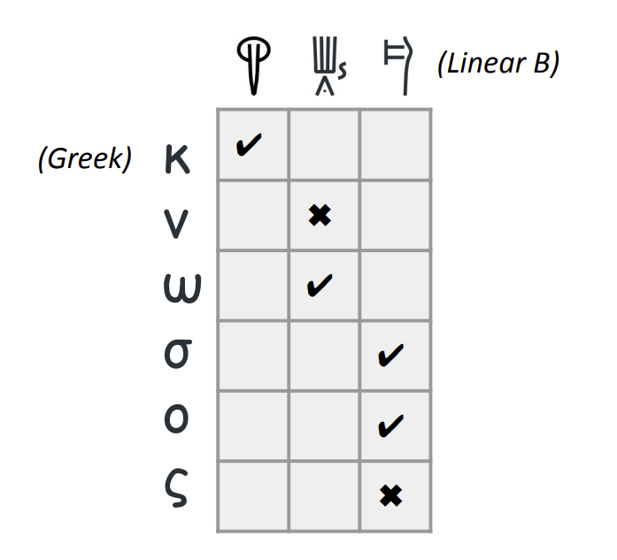

Scientists agree that the earliest form of writing appeared about 5500 years ago
in Mesopotamia, in the region that today borders Iraq. Writing, the earliest
examples of pictorial and symbolic narratives, reached the complex and
systematic structure we use today in Sumerian and much later evolved into
Assyrian in northern Mesopotamia. These samples were written mainly on tablets
called *cuneiform*. *Cuneo* means nail in Latin. The small cuneiform tablets
were made of clay, written with nails, then dried in the sun or an oven.
Different writing systems, scripts, or alphabets were used at different times
and geographies. Ever since I first saw these tablets in archaeological museums
when I was a child, there has been one question that has haunted me: How is it
that today we can read and understand texts from thousands of years ago, written
in languages that we have discovered in the last two hundred years or so?

With this question in mind, I have been searching for answers to "which
languages are lost and how to decipher them?" How were these decipherments done
in traditional ways, mostly at the beginning of the last century? In addition,
there have been interesting studies in this field using artificial intelligence
and mathematical methods in recent years. What opportunities can modern
technologies offer for the decoding of lost languages?

## A Secluded Civilization: The Mayans

How can languages be discovered whose grammar rules, alphabet, even the meanings
of the letters of the alphabet, words, and phonology are unknown to us? This
story is like the work of cryptanalysts decoding secret, coded messages. Alan
Turing, the founder of computer science, broke the coded messages of an Enigma
device which was used to encrypt and decrypt messages on a German submarine
during the Second World War. The most noteworthy difference is that the
resources on these languages are very limited, meaning we have very few texts.
The fact that we don't even know the languages and cultures that some of them
interacted with makes it even more difficult[^1].

If you think that only archaeologists or philologists can decipher the
inscriptions and tablets found in dead languages, you are wrong. Lost languages
have attracted the interest of people from many different fields. For example,
Richard Feynman, the famous theoretical physicist who received the Nobel Prize
in Physics in 1965, said that he found the numbers in Mayan hieroglyphics and
the Mayan calendar fun and exciting and talked about it in his lectures. Of
course, as with any discovery, there is a luck factor in languages. Others, not
Feynman, made the breakthrough in deciphering the Mayan script.

Speaking of the Mayan script, it is worth remembering that only four surviving
books are written in this language. In the 16th century, during colonization,
Spanish Franciscan missionary Diego de Landa burned all Mayan books. These books
are called "codices"; they are written on fig tree bark and are the size of a
folded travel guide: the Dresden, Madrid, Paris, and Grolier codices. The first
three were named after the cities to which they were taken and preserved by the
colonialists. The last one first appeared in the 1960s and was seen in an
exhibition at the Grolier Club in New York. Its authenticity was verified only a
few years ago. Landa, the cleric who burned all the hieroglyphs and tortured the
Mayans, ironically kept notes used to decipher the remaining books. This book,
*Relación de las cosas de Yucatán*, was forgotten in a library in Madrid. Until a
French priest who had worked in Guatemala, Abbé Charles-Étienne Brasseur de
Bourbourg became interested in the Mayans, discovered the *Relación*, and
published a facsimile edition in 1864. It's so exciting to think about, who
knows what books there might be in a library now about unknown or little-known
civilizations that have been forgotten for hundreds of years.

<figure>
    
    <figcaption style="color: gray; font-style: italic;">
        A page from the Dresden codex.   Source:
        <a
        href="https://de.wikipedia.org/wiki/Codex_Dresdensis#/media/Datei:Dresden_Codex_p09.jpg">Wikipedia</a>
    </figcaption>
</figure>

## Michael Ventris' Discovery of Linear B

Even Homer mentions in the Odyssey the city of Knossos on Crete, where King
Minos ruled. But Knossos was discovered more recently, in 1878. Excavations
began in 1900 under the direction of British archaeologist Sir Arthur John Evans
and lasted thirty-five years. During this time, Evans found clay tablets.
Hieroglyphs, some of them not unlike those of Egypt, and two different scripts,
which he called Linear Class A and Class B. Linear A is from another excavation
in the south of the island. While working in Crete, Evans was reluctant to share
these tablets with the scientific world because he wanted to decipher them.
Because they were more numerous, he concentrated on Linear B, dating from
1400-1200 BC. He made little progress until he died in 1941. Evans was obsessed
with Linear B as its own language, independent of Greek. He even worked on
Cypriot scripts, which were very similar to Linear B, with texts identical to
Greek. However, contrary to what he thought, Linear B was even older than the
Greek alphabet and written in Mycenaean Greek.

<figure>
    

    
    

    <figcaption style="color: gray; font-style: italic;">
        A **"Linear B tablet"** from the Sir Arthur Evans collection.   Source: 
        <a
        href="https://sirarthurevans.ashmus.ox.ac.uk/images/high/An1910_218_o.jpg">University
        of Oxford, Ashmolean Museum, Sir Arthur Evans Archive</a>
    </figcaption>
</figure>

After a period of inaccessibility due to Evans' death and the Second World War,
American archaeologists Alice E. Kober and Emmett Bennett Jr. began working on
the clay tablets. In fact, Kober and Bennett paved the way for the decipherment
of Linear B. As Kober wrote in her 1948 paper on Minoan writing, an unknown
language, and an unknown writing system cannot be deciphered. Philologists who
want to analyze a language encounter three unknowns: language, writing, and
meaning. They must somehow connect them by knowing the language or discovering
the acoustic equivalents of the glyphs. Thereby, they reduce the unknowns in the
equation. Kober, being a classicist, studied how the conjugation of nouns and
verbs changed. His most important discovery was that by making conjugation
tables, he found that the end or beginning of a word varied according to gender
and number. For example, in Latin, the cases of the noun are nominative
(nominative case), accusative (accusative case), genitive (possessive suffix),
genitiv (genitive), dativ (accusative case) (e.g., dominus, dominum, domini,
domino) or the conjugation of verbs according to persons (amo, amas, amat,
amamus, amatis, amant). These conjugations were also more frequent in Linear B
and different from Linear A. The recurrence of similar patterns in the language
is also an important clue for analyzing the language. On the other hand, since
Linear A is found only in Crete and in small numbers, but Linear B is found in
large numbers in mainland Greece, in Pylos (Navarin), they concentrated on
Linear B. Bennett discovered that the numerical systems of Linear A and B were
similar. Still, Linear A had fractional numbers like 1/2, 2/3, while Linear B
had separate words for fractions. Bennett showed that there are different
versions of the same letters and analyzed their statistical distribution.

We now come to the most unusual name working on Linear B: Michael Ventris.
Ventris is neither trained in archaeology nor is he a professional
archaeologist, nor is he rich like Evans. He joined the Royal Air Force during
the war and served as an aircrew member in the bombing of Germany. He later
studied architecture, but languages always interested him. A polyglot since
childhood, Ventris learned several European languages. At the age of fourteen,
he attended a lecture by Evans during a celebration in London and expressed his
desire to solve Linear B. So much so that four years later, he wrote an article
in the American Journal of Archaeology linking Linear B to Etruscan, which we
know today is incorrect.

Ventris did not stop after that. His primary tool was syllable tables. The rows
of the table listed the consonants without directly guessing what they were, and
the columns listed the vowels that appeared with them. After these tables, he
had grammar, context, and orthography. The grammar, especially the grammar, and
the different inflectional patterns depending on the case of the noun and gender
added another difficulty to the problem. The context analysis of the Pylos
tablets revealed over five thousand sign groups. Now we live in the age of the
internet and can collaborate with people thousands of kilometers away by a video
call from home. Ventris would compile these tables and his conclusions into
working notes and mail them to dozens of researchers. So he had the chance to
get their comments and criticism. One of the things that led Ventris to success
was that while analyzing the syllable connections in his tables, he focused on
the place names in Crete, whose names are known in classical texts and also
recurred in the tablets. He came closer to a solution when he realized they were
linked to Greek. His twentieth note, sent between 1951-52, was entitled: "Were
the Knossos tablets written in Greek?" He began and ended this note by
apologizing for being speculative. If Linear A and B are different languages, as
Kober and Bennett have concluded, and Linear A was found in various places on
the mainland and Knossos on Crete, it could very well be Greek. Linear A is
another pre-Hellenic language.

After two busy years, Ventris announced on a BBC radio program in 1952 that he
had solved Linear B and was contacted by John Chadwick, who had listened to the
program. Chadwick was a classicist and philologist from Cambridge University who
had participated in the decryption work at Bletchley Park during the war. They
worked on Ventris's discovery for four years and turned it into a book.
Unfortunately, Ventris died in a car accident shortly before the book was
published.

<figure>
    

    
    

    <figcaption style="color: gray; font-style: italic;">
        I found examples of the tables that Ventris created in Linear B
        decipherment and shared in his notes in Maurice Pope's book, **The Story
        of Decipherment**[^3].
    </figcaption>
</figure>

## How Artificial Intelligence and Computational Sciences Can Help?

Especially in the last decade, artificial intelligence, or more precisely, the
sub-branch of artificial intelligence called machine learning and deep learning,
has made incredible advances. For example, we can translate a website or an
article we have written into another language with very few errors. For example,
it is possible to find an entire library in two languages that can train machine
translation systems from Turkish to English. Unfortunately, there is no such
data between Ancient Greek and Linear B. On top of that, deep learning methods
require large amounts of data, and all the texts we have are very limited
compared to those in today's languages.

The idea behind machine translation goes beyond the manual context analysis that
philologists do: To examine how often words are used interchangeably in a
language and to define a set of variables to represent all the words in that
language. So, for example, let's do a mathematical operation like
"king-male+woman" with the vectorial expressions of each word, and it gives us
the word "queen." What will lead us to translation here is to ensure that the
same phrase has the same vectorial value in different languages. Since there is
no one-to-one correspondence, current technology gets bogged down in translating
dead languages.

A study published by Jiaming Luo and Regina Barzilay from the Massachusetts
Institute of Technology and Yuan Cao from Google showed that machine translation
from Linear B into Greek is possible[^2]. What they do is recognize that languages
can only change in specific ways. For example, the letters used the sequence of
letters or the words. So they identify words from the same root (cognate) in two
languages and translate between them. This study, the first example of machine
translation from Linear B to Greek, translates cognate words into Greek with
67.3% accuracy. Their method works with similar accuracy between Hebrew and
Ugaritic, another ancient Mediterranean civilization and one of the oldest
alphabets. Remains of Ugaritic were found in the Ras Shamra region in what is
now Syria and date to around 1300 BC. Similar to the relationship between Linear
B and Greek, Ugaritic cuneiform only used around thirty symbols as letters. The
language is from the Semitic language family and significantly resembles Hebrew.

<figure>
    

    
    

    <figcaption style="color: gray; font-style: italic;">
        Luo et al.'s method for machine translation from an
        unknown to a known language. A recurrent neural network model of "long
        short-term memory" (LSTM) encoding and decoding networks and attentional
        mechanisms between them.   
        Source:
        <a href="https://aclanthology.org/P19-1303/">ACL Anthology </a>
    </figcaption>
</figure>

<figure>
    

    
    

    <figcaption style="color: gray; font-style: italic;">
        Examples of correct and incorrect matching between Linear B and Greek letters.   Kaynak: 
        <a href="https://aclanthology.org/P19-1303/">ACL Anthology </a>
    </figcaption>
</figure>

## Conclusion

As a consequence, one of the areas where artificial intelligence, statistics,
and data science are making breakthroughs in natural language processing
applications. Currently, machine translation is not very easy, even in Turkish.
In 2018, Google Translate caused a stir when it translated "He is a doctor" as
male and "She is a nurse" as female. This is clearly because the third-person
singular in Turkish is genderless, and machine translation systems reflect the
bias in existing texts. These technologies will take a while to be more accurate
in low-resource languages. Decipherment is even more difficult for Linear A,
Indus, Proto-Elamite inscriptions, and dozens of undeciphered dead languages.

Thanks to developments in artificial intelligence and interdisciplinary
cooperation, Digital Humanities offer solutions to researchers working in
different fields, such as linguistics, archaeology, and architecture. Who knows,
maybe soon, new technologies will not only change and transform the way we live
today but will also be instrumental in accessing the unknowns of the past.

[^1]: Andrew Robinson, Lost Languages: The Enigma of the World’s Undeciphered
Scripts (Thames & Hudson, 2009).

[^2]: Jiaming Luo, Yuan Cao ve Regina Barzilay, “Neural Decipherment via
Minimum-Cost Flow: From Ugaritic to Linear B.”, Proceedings of the 57th Annual
Meeting of the Association for Computational Linguistics, 2019. John Chadwick,
The Decipherment of Linear B (Cambridge University Press, 1990).

[^3]: Maurice Pope, The Story of Decipherment: From Egyptian Hieroglyphs to Maya
Script: From Egyptian Hieroglyphs to Maya Script (Thames & Hudson, 1999).

