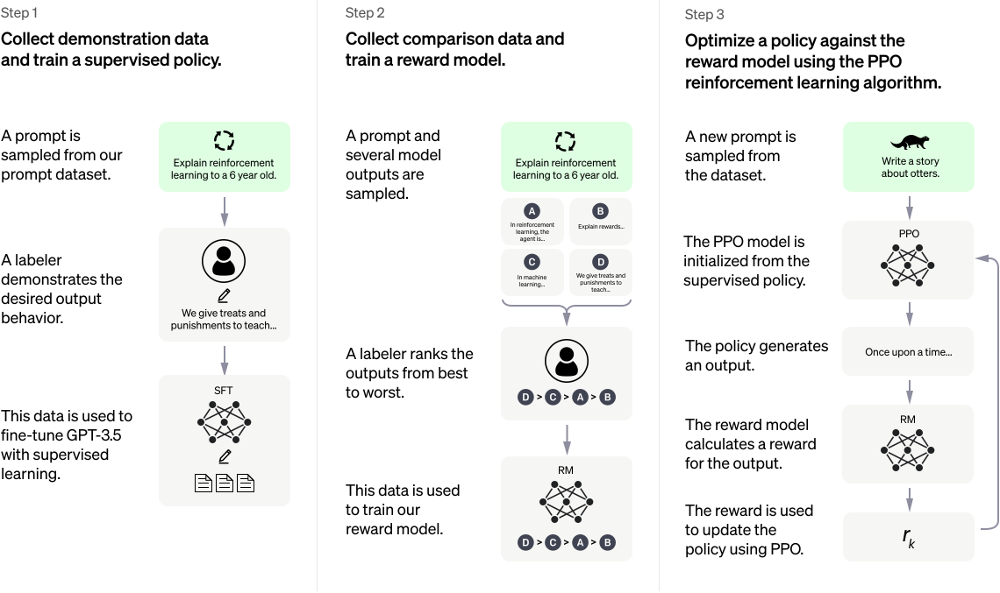

ChatGPT is a natural language processing model developed by OpenAI. In the last few days, you must have either heard about it somewhere or tested it yourself by asking ChatGPT different questions. If you haven't heard of it and haven't tried it, there is no need to panic because you are already using language models at some stage of your life without realizing it, or you will do so very soon. In this article, I will discuss how large language models [LLMs: Large Language Models], ChatGPT in particular, work, what they can be used for, their benefits, and possible risks.

## Large Language Models (LLM)

Not only OpenAI's ChatGPT and previous GPT models, but there are also many more: Microsoft's Bing AI, which threatens the user and takes on different personalities; Meta's LLaMA, which has been criticized on social media for the false texts it produces; and so on. So how do big language models work, and what do they do?

In the last decade, when deep learning has been on the rise, new methods were first developed to solve a specific problem in one type of data. Then, over time, they were applied to other fields. Sometimes the starting point was image processing (computer vision), sometimes acoustic sound analysis, sometimes natural language processing. It is only in the last few years, after innovations in recurrent neural networks and the development of "attention mechanisms", that natural language processing has developed. Big language models are deep learning models with billions of trainable parameters that solve natural language processing problems such as question answering, conversational chat (with chatbots), text summarization, machine translation, and so on. The "big" in the name comes both from the fact that the model consists of billions of parameters and that the texts they are trained on are very large[^1].

Big language models owe their success to the availability of big data, advances in high-performance computing, iterative boundary networks, and attention mechanisms, but most importantly, to unsupervised learning methods. Unsupervised learning is a form of learning that aims to recognize and make sense of patterns directly in big data without any labeling by human labor. In supervised learning, data samples in different forms, such as images, video, audio, or text, are labeled by one or more humans. Let's train a deep learning model to detect and recognize objects in given images. For example, detecting birds and classifying their species. In order to train a model with supervised learning that solves this problem with acceptable performance, both the location of the birds in the images and their species must be labeled by human hands. For each species, perhaps thousands of images need to be labeled. No matter how much data we have, labeling with supervised learning is both difficult and time-consuming. Unsupervised learning allows us to discover and understand patterns in the data in different ways.

GPT stands for **G**enerative **P**re-**T**raining. In many language models, pre-training is usually performed by unsupervised learning. Then, the learned deep learning model is adapted by transfer learning to solve other desired problems using a small amount of labeled data. New large language models can even perform well on actual tasks without the need for transfer learning. So what are examples of unsupervised learning in big language models?

These models were trained in a self-supervised way. Self-supervised learning aims to recognize patterns in unlabeled big data by using auxiliary learning tasks that is considered relevant for the downstream tasks (desired end task, for instance, neural machine translation or question answering). The most widely used method in natural language processing, notably GPT-1 and GPT-2 developed by OpenAI, is to predict the next word in a given sentence or much longer text. It may seem irrelevant at first glance, but generating the next word is a widely used method that helps with many learning problems such as question answering, conversation, text summarization, machine translation, and so on.

In GPT-3, we see that both the training set and the model size have grown significantly. While GPT-2 had 1.5 billion parameters, GPT-3 had 175 billion parameters. Already large language models will be trained with larger models on larger datasets in a few years. Since the 1970s, the number of transistors that can fit on the same-sized electronic board has been doubling roughly every two years due to advancing technology, and this linear increase is known as Moore's law. And every year since 2018, the number of parameters in large language models has been increasing linearly[^2]. At the time of writing, the GPT-4 model was rumored to be coming out soon, possibly with different modes such as images and video in addition to text.

ChatGPT, which we've heard a lot about lately, is based on the GPT-3 model but trained specifically on dialog datasets. Reinforcement learning is also used in ChatGPT. Reinforcement learning is another sub-branch of machine learning and artificial intelligence. We can explain reinforcement learning in simple terms: There is an agent, the machine learning model that performs the learning, and an environment. At each step, this agent performs one of a series of actions, and at the end of several steps, a reward function is calculated based on its success, and its state in the environment is updated. It's a bit like playing a game. In many games that AI has already solved, from Atari to chess and even Go, reinforcement learning is part of the solution. What we mean by "solving the game" here is the development of an artificial intelligence method strong enough to beat the strongest computer model or world champion in that game. For example, in 2016, AlphaGo[^3] developed by DeepMind, defeated World Go Champion Lee Sedol. AlphaGo also used reinforcement learning[^4].

<figure>
    

    
    

    <figcaption style="color: gray; font-style: italic;">
        Flowchart showing how ChatGPT is trained in three stages, source: [OpenAI](https://openai.com/blog/chatgpt)
    </figcaption>
</figure>

The figure above shows how ChatGPT is trained. Since ChatGPT is designed to be used for chatting, the first step is to ask the user to make an input; this is called a prompt. For each input, the expected responses are collected. Transfer learning is performed on such a dataset. Prompt engineering[^5] refers to a conversation with a chatbot that writes text to language or image-generating models and fills in the logical gaps of the AI system. This is a real profession, and the tech companies that develop and use these chatbots employ staff for this work. In the second stage, ChatGPT generates the different possible answers for the given prompts, and with human help, these answers are ranked from good to bad, and the model is trained on this labeled data. In the third stage, the model is further refined using a reinforcement learning algorithm [Proximal Policy Optimization, PPO], initialized with the parameters previously trained in a supervised manner.

## An Opportunity or an Illusion?

We briefly discussed how ChatGPT and big language models work. Big language models and similar artificial intelligence models will be a part of our lives, and we will have to use them somewhere, whether we want to or not. So, will their use in customer service put people who work in these jobs out of the market? Should we see these technologies as an opportunity or an illusion? Are we trusting them above their abilities and being overly optimistic about them?

I look at this from a critical and skeptical point of view. The positive aspect is the potential to make many tasks in the business world less dependent on humans. In this way, people doing jobs that could be delegated to robots or chatbots can move into professions where manual labor and creativity are important. However, depending on the large data sets they are trained on, we know that these language models harbor human biases. They can produce sexist, racist, or violent texts. Combined with automatic speech recognition and intelligent avatars, they can be used to interact on-screen or with a robot. These uses remind me of dystopian scenes from Black Mirror. Of course, there are good uses, such as helping the elderly or people with disabilities in daily life, computer-assisted psychotherapy, education and training, and countless other applications. So it is worthwhile to see the shortcomings of ChatGPT and other large language models while avoiding over-optimization.

A few days ago, The New York Times published an article by world-renowned linguistics professor Noam Chomsky, another linguistics professor, Ian Roberts, and Jeffrey Watumull[^6] Both Chomsky's name and the title of the article, "The False Promise of ChatGPT", already give a clear indication of their point of view. I was very interested in the part of this article where he talks about a child's language learning and acquisition. Children learn unconsciously and automatically through an innate system, even if they are exposed to very few examples. Linguists laboriously develop difficult and complex rules to explain logic and grammar. Large language models like ChatGPT have been trained with over 45 terabytes of data and different dialog datasets whose content we don't know. In other words, artificial intelligence consists of recognizing patterns in an existing data set. It doesn't have the same reasoning and common sense as a human being. It is also unclear whether it will have this ability in the future.

Beyond the linguistic aspect, there are fundamental differences between the way AI learns and the way a baby learns. Linda Smith and Michael Gasser[^7] examine six lessons to be learned from a baby's learning. Briefly put, babies are multimodal (they perceive the world with different sensors), they can develop themselves over time, they have a world with which they physically interact, and their intelligence is distributed through this interaction and experience. Babies accept an adult teacher and move into a social world under their guidance. Babies learn a language and can make higher-level, abstract distinctions.

When you push chatbots a little too far, it is possible to get ridiculous or misinformed answers. Sometimes it is not as easy as it seems to check the accuracy of the answers and not be fooled by false information. Text produced by chatbots that is spelled correctly and even seems logical at first glance may contain untrue information. It's hard for us as users to notice. That's why it's even more important that we have the ability to fact-check.

Recently, Meta announced another major language model, LLaMA. The company said it would share this model with researchers upon request. However, the model was shared online by a user in an unauthorized way. It is also possible that these models could be used for malicious purposes. While the openness of datasets, source code, or trained models is good for scientific research, it is a bit more complicated for big language models. In the hands of a malicious actor, such a tool could be used, for example, to write fake reviews of products for commercial gain. As we know from the Cambridge Analytica scandal, they can also be used to manipulate public opinion on certain issues, or even elections. In an open letter published a few days ago, Arvind Narayanan, a professor of computer science at Princeton University, and Sayash Kapoor, a Ph.D. student, shared examples and concerns about the misuse of LLaMA and similar models[^8]. As they state in their letter, we should demand that companies that develop or use large language models be more transparent and disclose the misuse of these tools. Similarly, social media platforms should combat disinformation from language models.

As people in developmental psychology or linguistics have pointed out, we need to recognize that ChatGPT and similar large language models are in many ways far from the intelligence, perception, thinking, and interactivity of an infant. Maybe we will never reach that level. Computer scientists, cognitive science researchers, and philosophers have different ideas about artificial general intelligence and singularity. In this article, I share my thoughts on ChatGPT and big language models, which are popular these days. It is impossible to understand and make sense of how big language models will behave in what situation. This is not the case with artificial intelligence models based on an ontology, using knowledge representation and reasoning, a mathematical model describing a complex system, or research involving theory and simulation of control systems. Although I have emphasized the dangers rather than the opportunities, ChatGPT has already been integrated into different digital applications[^9]. It can be useful in limited use cases while being aware of these risks. Over time, we will see both bad uses and good applications of big language models[^10].

[^1]: Without going off-topic, it is worth mentioning the environmental impact of these models. The electricity required to train a single model, for instance, the GPT-3 model, is 1.287-gigawatt hours. That's equivalent to the annual electricity consumption of about 120 homes in the US. The carbon emissions from this energy are 502 tons, equivalent to the annual carbon emissions of about 110 cars. Source: [Bloomberg](https://www.bloomberg.com/news/articles/2023-03-09/how-much-energy-do-ai-and-chatgpt-use-no-one-knows-for-sure).

[^2]: Julien Simon, “Large Language Models: A New Moore’s Law?”, Hugging Face, 26.10.2021. [https://huggingface.co/blog/large-language-models](https://huggingface.co/blog/large-language-models)

[^3]: [Wikipedia](https://en.wikipedia.org/wiki/AlphaGo_versus_Lee_Sedol), 01.03.2023.

[^4]: David Silver, Aja Huang, Chris J. Maddison, Arthur Guez, Laurent Sifre, George Van Den Driessche, Julian Schrittwieser et al., “Mastering the game of Go with deep neural networks and tree search” *nature* 529, no. 7587 (2016): 484-489.

[^5]: Aaron Mok, "Prompt engineering is one of the hottest jobs in generative AI. Here’s how it Works”, Insider, 01.03.2023. [https://www.businessinsider.com/prompt-engineering-ai-chatgpt-jobs-explained-2023-3](https://www.businessinsider.com/prompt-engineering-ai-chatgpt-jobs-explained-2023-3)

[^6]: Noam Chomsky, Ian Roberts ve Jeffrey Watumull, "Noam Chomsky: The False Promise of ChatGPT", The New York Times, 08.03.2023. [https://www.nytimes.com/2023/03/08/opinion/noam-chomsky-chatgpt-ai.html](https://www.nytimes.com/2023/03/08/opinion/noam-chomsky-chatgpt-ai.html)

[^7]: Linda Smith ve Michael Gasser, "The development of embodied cognition: Six lessons from babies." *Artificial life* 11, no. 1-2 (2005): 13-29.

[^8]: Arvind Narayanan ve Sayash Kapoor, "The LLaMA is out of the bag. Should we expect a tidal wave of disinformation?" *Algorithmic Amplification and Society Blog*, Knight First Amendment Institute at Columbia University, 06.03.2023. [https://knightcolumbia.org/blog/the-llama-is-out-of-the-bag-should-we-expect-a-tidal-wave-of-disinformation](https://knightcolumbia.org/blog/the-llama-is-out-of-the-bag-should-we-expect-a-tidal-wave-of-disinformation)

[^9]: [OpenAI](https://openai.com/blog/introducing-chatgpt-and-whisper-apis), 01.03.2023.

[^10]: I asked ChatGPT to write something for this text, and the topic is architecture. English traslation of my prompt was as follows: Could you write an article on the following topic, using architectural terminology and giving examples: How do developments in technology, engineering, and building materials affect modern Turkish architecture? \
*The original prompt and text were produced by ChatGPT in Turkish. It is fine in terms of structure or grammar; however, even kids in secondary school could write an essay with stronger arguments and more concrete examples. Maybe I am a bit biased against the use of large language models :)* \
**Ömer:** Mimarlık terminolojisini kullanarak ve örnekler de vererek, aşağıdaki konuda bir yazı yazar mısın: Teknoloji, mühendislik ve yapı malzemelerindeki gelişimler, modern Türk mimarisini nasıl etkiliyor?\
**ChatGPT:** \
Elbette, şimdi bu konu hakkında bir deneme yazabilirim.
Teknoloji, mühendislik ve yapı malzemelerindeki gelişmeler, modern Türk mimarisini önemli ölçüde etkilemektedir. Geleneksel mimari anlayışlarının yanı sıra Türk mimarları bu yenilikleri kullanarak özgün tasarımlar üretmektedir.
Mimari tasarımda kullanılan teknolojik araçlar ve malzemeler, inşaat sürecinde zaman ve maliyet tasarrufu sağlamaktadır. Örneğin üç boyutlu yazıcılar kullanarak inşaat malzemeleri ve yapı elemanları üretmek mümkündür. Böylece inşaat sürecinde zamandan ve maliyetten tasarruf edilirken aynı zamanda doğal kaynakların daha verimli kullanılması sağlanabilir. Bu teknolojiler aynı zamanda daha karmaşık tasarımların üretilmesine de olanak tanır.
Mühendislik gelişmeleri de modern Türk mimarisinin tasarımına etki ediyor. Yüksek katlı binaların inşası için kullanılan yapısal çelik ve cam malzemeler, modern mimaride yaygın olarak kullanılmaktadır. Ayrıca çevre dostu malzemeler de kullanılmaktadır. Örneğin yenilenebilir enerji kaynaklarından elektrik üreten güneş panelleri ve rüzgâr türbinleri gibi teknolojiler, mimari tasarımlarda daha sık görülmektedir.
Modern Türk mimarisi geleneksel ve modern tasarım anlayışlarının bir araya gelmesiyle şekillenmektedir. Mimarlar geleneksel Türk mimarisinin çatı yapısı, avlular ve açık alanlar gibi özelliklerini modern tasarım anlayışıyla birleştirerek benzersiz tasarımlar oluşturmaktadır. Örneğin Atatürk Kültür Merkezi’nin yeniden tasarımı geleneksel mimariye saygı duyarken modern tasarım öğeleriyle birleştirilerek, kendine özgü bir tasarım yaratılmıştır.