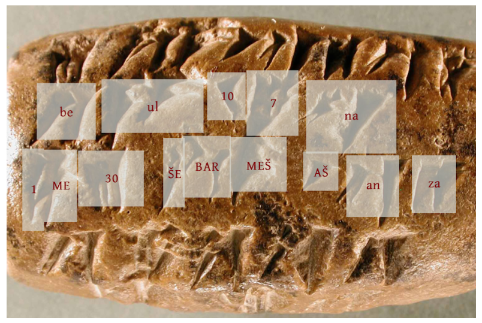
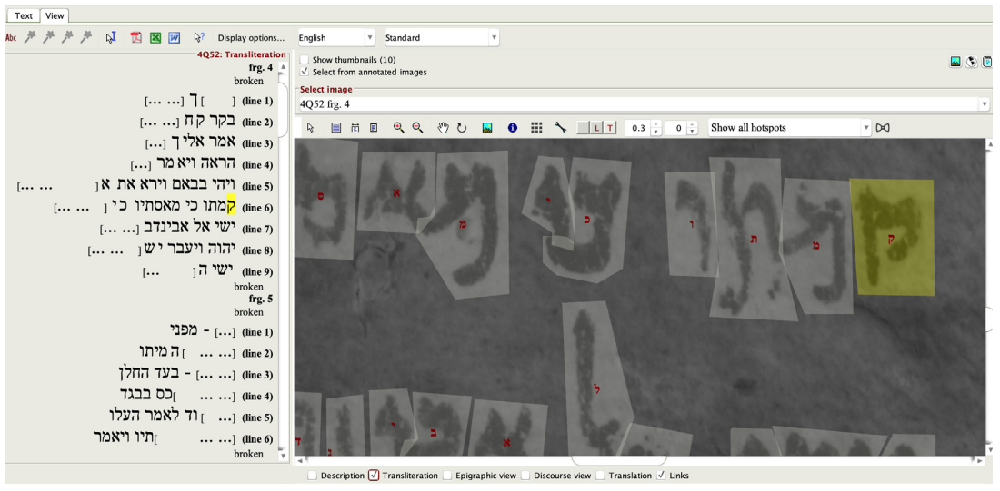
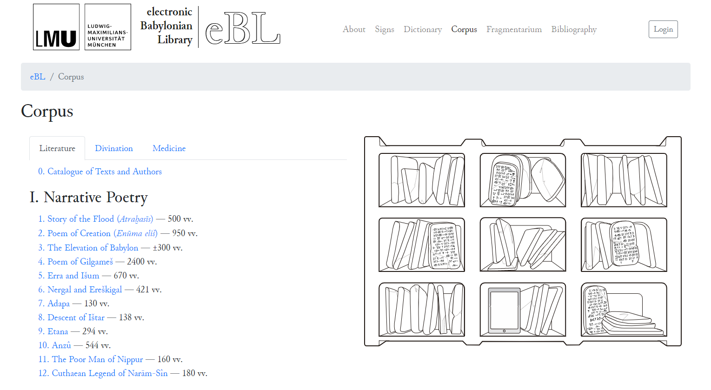
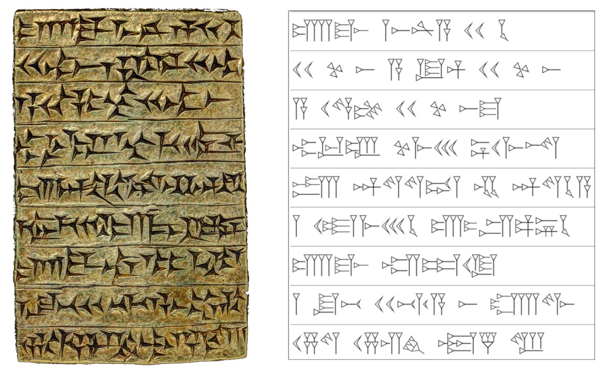
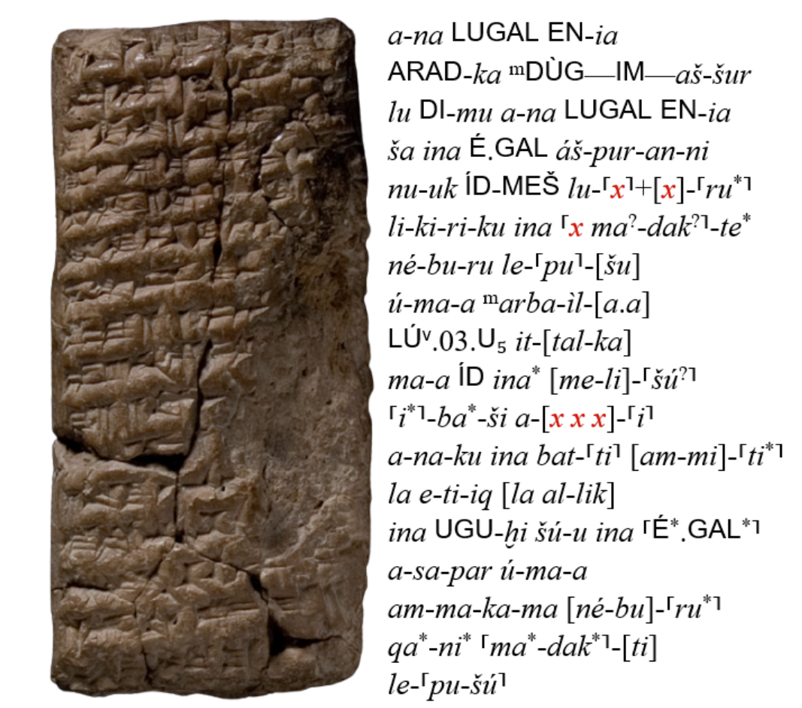

Previously, I discussed how archaeologists and philologists use historical examples to decipher lost languages, as well as the opportunities provided by artificial intelligence. Paleography, derived from the Greek words *palaiós* [ancient] and *graphea* [spelling], is concerned with reading and comprehending various types of writing as well as deciphering their meaning and significance in a historical context. Experts have been working for months to comprehend these tablets, which are only a few centimeters in size. Even historical documents written in long-dead languages or on cuneiform clay tablets, about which we know a great deal, are difficult to comprehend. Automatic character recognition and language processing technologies are now allowing researchers to conduct more advanced social and cultural analyses of texts, rescuing them from time-consuming and monotonous work. Let's look at that in this article.

## Reading the Persepolis Fortification Archive

When we talk about cuneiform clay tablets, we are talking about tens of thousands of tablets in different languages from different excavations. Translating these tablets into modern languages and understanding their historical and social aspects is very difficult. The human labor part of the work is so heavy that the study and understanding of some texts may even exceed a human lifetime. Furthermore, any research group working on these challenges now collaborates with other organizations working on the same topic in various regions of the world. So, developing tools for interdisciplinary collaborations is highly important for digitizing documents.

The University of Chicago has one of the most important institutes and research groups in archaeology and philology in the world. Since excavations last for decades, the universities that carry out the first excavations are also at the forefront of subsequent discoveries and research on those cultures. The first excavations of Persepolis, the capital of ancient Iran, were initiated in 1931 by German archaeologist Ernst Emil Herzfeld, who was commissioned by the Oriental Institute of the University of Chicago. The archive of this institute alone contains tens of thousands of clay tablets that have survived to this day.

<figure>
    
    <figcaption style="color: gray; font-style: italic;">
        A cuneiform clay tablet from the Persepolis archive of the Oriental Institute at the University of Chicago. Markings in Elamite are labeled on the image, source: 
        <a href="https://cs.uchicago.edu/news/ancient-language-processing-teaching-computers-to-read-cuneiform-tablets/">University of Chicago</a>
    </figcaption>
</figure>

But how can we automatically recognize the markings on these tablets? This problem is addressed by computer vision, which is a sub-branch of artificial intelligence. It's referred to as automated character recognition. Many scanners today also translate digitized text into text. Sanjay Krishnan, a professor of computer science at the University of Chicago, has accomplished the same task using deep learning models in the Elamite language [^1]. To do this, a huge training set was developed by marking which signs were in the boxes on around 6,000 tablets. The deep learning model they used is one of the earliest architectures, AlexNet, which is widely used in autonomous driving or various daily life applications on our cell phones and achieved over eighty percent accuracy in transcribing these tablets[^2]. This performance alone appears to make the work of paleographers much easier.

One step beyond computer vision is natural language processing (NLP). All languages have a certain statistical distribution of consecutive signs (or even words or concepts). Image processing may not recognize a character correctly, but NLP models learn the most likely sign for each character in a sequence and choose the one that best fits the structure of the language.

<figure>
    

    
    

    <figcaption style="color: gray; font-style: italic;">
        An example of digital tools for paleography. A screenshot from the University of Chicago's Online Cultural and Historical Research Environment (OCHRE) software. A section from the Dead Sea scrolls, source: Sarah Yardney, Miller Prosser, and Sandra R. Schloen, "Digital Tools for Paleography in the OCHRE Database Platform," A Journal of Biblical Textual Criticism 25 (2020): 129-143.
    </figcaption>
</figure>

While the use of data science and algorithms can be exciting for computer scientists, sometimes seemingly simpler technologies can be of great help to experts in the field. The OCHRE software developed by the University of Chicago allows different researchers to access the same data and edit images and text through an interface. In this way, a large number of texts can be labeled and classified by different researchers according to the same standards. Photographs of texts may not have been taken under ideal conditions. With simple image filters, users can make the tablet easier to read.

## Electronic Babylonian Literature

More and more ancient texts are being digitized. Research groups around the world continue to digitize cuneiform tablets. Last February, Dr. Enrique Jiménez, professor of Ancient Near Eastern Literature at the Ludwig Maximilian University of Munich, and his team announced the release of a previously unpublished 30,000-line Akkadian text[^3]. Artificial intelligence was used to transcribe a text of this size. The text they made available includes the Babylonian creation myth (Enūma Eliš) and the full text of the Epic of Gilgamesh.

<figure>
    

    
    

    <figcaption style="color: gray; font-style: italic;">
        Screenshot of the Electronic Babylonian Literature (eBL) collection of the Ludwig Maximilian University of Munich, source: [eBL/Corpus](https://www.ebl.lmu.de/corpus)
    </figcaption>
</figure>

I wondered what was behind a transcription on this scale, and I wondered, "I wonder what methods they used?" A few years ago, in a paper co-authored by Dr. Enrique Jiménez, they explained a little bit about the methods they used. Let's look at some of the details of that.

<figure>
    
    <figcaption style="color: gray; font-style: italic;">
       Cuneiform characters on a clay tablet and their conversion to Unicode characters, source: Shai Gordin, Gai Gutherz, Ariel Elazary, Avital Romach, Enrique Jimenez, Jonathan Berant, Yoram Cohen, "Reading Akkadian cuneiform using natural language processing" PloS ONE, 15(10), e0240511, (2020).
    </figcaption>
</figure>

The tablet shown is from the Yale University archive. It was recovered from the palace of the Assyrian king Ashurnasirpal II in the city of Apqu (at the archaeological site of Tell Abu Marya, near present-day Mosul). Unusually, the tablets are made of gold and silver instead of clay. The process of converting such text into standard characters, as seen on the right, is called transliteration. In this paper, the transliteration process is analyzed using statistical and deep learning methods.

Using digital technologies, a three-stage process is performed on such tablets. The first stage is the automatic identification of these signs, also called "glyphs", on two- or three-dimensional images of these tablets. This is a problem in the image domain and is solved using computer vision. The second stage is the transliteration and decomposition of these signs. The final stage is the automatic translation into today's languages and their verification with human assistance. What makes the second and third stages difficult in Akkadian and even in other languages is that the meaning of the glyphs, the word, and its pronunciation change depending on the preceding and following glyphs. The second stage breaks down sequences of one or a few glyphs into meaningful word fragments. The texts are thus transliterated into the languages we use today.

Transliteration, or the computational methods that do the translation, is capable of understanding and analyzing not just a single character, but the inter-relationship of many characters in a sequence. The writings we are mostly talking about are cuneiform and written on clay. They are likely to have been damaged either over time or during archaeological excavations. But what if there are missing glyphs?

## Filling the Gaps in Clay Tablets
<figure>
    
    <figcaption style="color: gray; font-style: italic;">
       Another Akkadian tablet and its transliteration. What is interesting here is the presence of unreadable glyphs in the cracked and shattered parts of the tablet. This is an artificial intelligence-based method and it manages to fill in the gaps. Source: Koren Lazar, Benny Saret, Asaf Yehudai, Wayne Horowitz, Nathan Wasserman, Gabriel Stanovsky, "Filling the Gaps in Ancient Akkadian Texts: A Masked Language Modeling Approach", in Proceedings of the 2021 Conference on Empirical Methods in Natural Language Processing, pp. 4682-4691.
    </figcaption>
</figure>

The figure above shows a damaged clay tablet. We see the transliteration next to it, but there are missing glyphs. In 2021, Koren Lazar and colleagues from the Hebrew University of Jerusalem published a paper on completing missing glyphs in Akkadian tablets. The method they use is Bidirectional Encoder Representations from Transformers (BERT), one of the big language models we've all heard about recently. BERT is similar to the GPT model, includes attention models, and is trained with unsupervised learning. Both models can be used for problems such as question answering, text summarization, and machine translation.

On Akkadian data, the BERT model is trained in a masked fashion; that is, not only the texts with broken and missing parts but also random glyphs on top of the intact ones are masked, and the BERT model is trained to fill these gaps. It even works better when trained on the 104 languages with the most content in Wikipedia first, and then transfer learning is performed on Akkadian data.

Although we expect that the content in Wikipedia and modern languages will be different from Akkadian, the model trained on these 104 languages performs much better in filling the gaps in Akkadian tablets. It was even useful to use English transliterations in addition to the transliterations of the glyphs. Akkadian was the lingua franca of an era. Many official documents, such as the Kadesh Treaty of 1269 BC, were originally written in Akkadian. In fact, the language dates back even further, to 2500 BC. It is very exciting that an attention model trained in modern languages, many of which are relatively new, can fill in the gaps in Akkadian texts. Perhaps there are many similarities between languages that we consider distant, and we just don't know it yet.

In this article, I described how current technologies can be used to digitize cuneiform clay tablets. Maybe most intriguing is that the large language models (similar to the popular GPT, ChatGPT, or Bard that we recently heard more often) perform well even in resource-limited ancient languages. Their use for such purposes offers great opportunities to digitize, preserve, and better understand our cultural heritage.

[^1]: Ancient Language Processing: Teaching Computers to Read Cuneiform Tablets, *UChicago CS News*, 13 February 2020.
[^2]: These videos can help those who want to learn more about the DeepScribe project's method: [https://voices.uchicago.edu/ochre/project/deepscribe/](https://voices.uchicago.edu/ochre/project/deepscribe/)