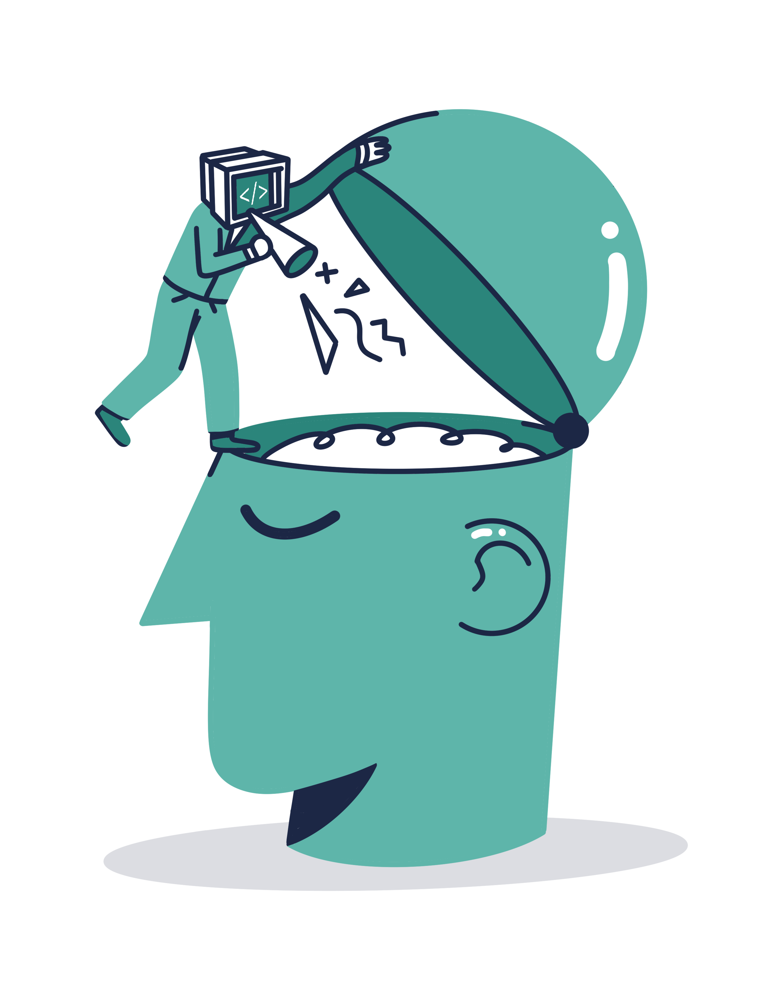
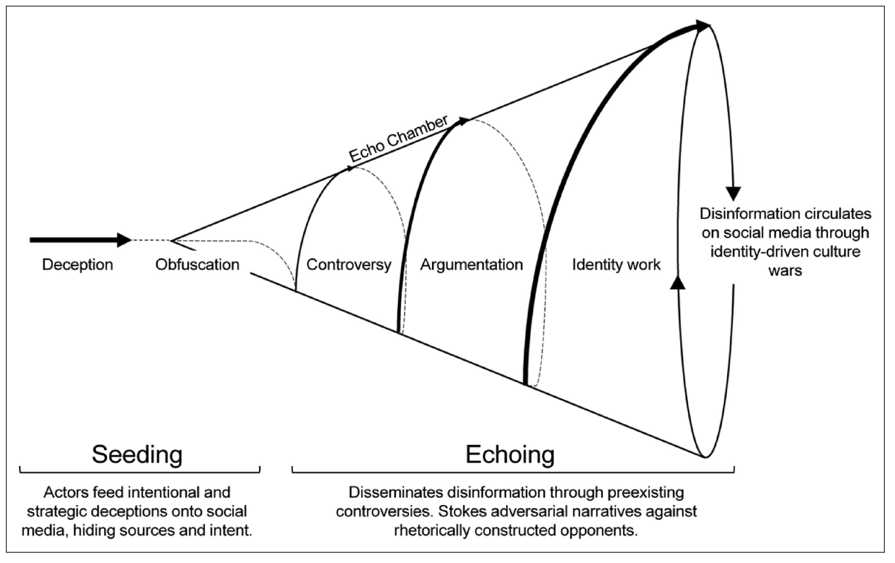

::: {.column-margin}
<figure>
    
    <figcaption style="color: gray; font-style: italic;">
        The image above was created by graphic designer Soner Aktaş for Frankfurter Allgemeine Zeitung (FAZ) newspaper in May 2023; I thank him for permission to use. You can find the artist's illustrations and animations on various subjects on his
        <a href="https://www.instagram.com/justnoodleanddoodle/">instagram</a> account.
    </figcaption>
</figure>
:::

Human decisions are often far from objective. We don't readily accept the questioning of ideas that we have known and kept for a long time and firmly defend them. When confronted with something new that challenges our beliefs or preconceptions, we are more likely to adopt a biased viewpoint. On top of that, most of the time, whether in social life or on virtual platforms, we want to have audiences who applaud and like what we say, and we want to be their influencer. These generalizations are not always and not for everyone, but there are complex dynamics and different biases behind human decisions.

Confirmation bias is one of the topics in psychology that is being researched in terms of what it is, how it occurs, its causes, and consequences. In recent years, especially user experience research has started to create evaluation processes that do not create confirmation bias or take this bias into account. In particular, human-in-the-loop applications of artificial intelligence (AI), or more broadly, human-machine interaction, have many situations where confirmation bias should be considered. 

Confirmation bias is defined as conducting research or evaluating information that supports our prior ideas, expectations, or a hypothesis that we are clearly in favor of [^1]. Although Raymond Nickerson's 1998 article is a significant recent source on confirmation bias, the notion is not new. It is worth noting the following quote by Francis Bacon, which is also featured in the article:

> "The human understanding when it has once adopted an opinion (either as being the received opinion or as being agreeable to itself) draws all things else to support and agree with it. And though there be a greater number and weight of instances to be found on the other side, yet these it either neglects and despises, or else by some distinction sets aside and rejects; in order that by this great and pernicious predetermination the authority of its former conclusions may remain inviolate... And such is the way of all superstitions, whether in astrology, dreams, omens, divine judgments, or the like, wherein men, having a delight in such vanities, mark the events where they are fulfilled but where they fail, although this happened much oftener, neglect and pass them by."

Indeed, the people Bacon mentions who *can't stay fortune-telling* perceive positive examples and hence legitimize astrology. From anti-vaccinationists to various conspiracies, most people who accept unreasonable things seek evidence only to support their standpoint.

## Types of Confirmation Bias and Ways to Overcome

One of the ways in which we fall into confirmation bias is to seek and interpret information based on a hypothesis. In other words, we are assuming an idea to be accurate and making a diagnosis. It is also possible to express this as a conditional probability p(D | H). By not contradicting the hypothesis we assume to be accurate, we ignore the possibility of p(D | ~H), that our diagnosis is correct if the hypothesis is false. Sometimes, we fall into confirmation bias by prioritizing evidence supporting our beliefs.

We have information that either confirms or undermines our hypothesis. But sometimes, we interpret that information so that this view prevents us from rejecting a false hypothesis. Putting emphasis on the instances we want to believe in or seeking what we want to see might create an illusion and lead to a wrong conclusion. 

Let's take a couple of examples: The first is that people often hold on to long-held beliefs, even in the face of evidence that invalidates them. In a 1979 Stanford University study [^2], researchers presented two groups of people with equal evidence for and against capital punishment. However, both groups saw the evidence favoring their previous positions and did not change their minds.

The majority of the stuff we see on the internet is news and comments that we enjoy. Our access to information and the people we communicate with on social media are typically comprised of like-minded individuals. This is known as *echo chambers* or the *bubble effect*. Our own choices are essential in shaping it, but the algorithms of social media companies that personalize content also play a role. The goal of these algorithms is, of course, to retain our attention on those platforms longer and to boost user interaction and engagement. Confirmation bias is caused by social media and these filtering algorithms that affect our attention.

A paper by Carlos Diaz Ruiz and Tomas Nilsson [^3] explains how fake news or disinformation spreads through echo chambers on social media. The figure provides a visual summary of this. In the first stage, malicious actors circulate strategic lies on social media, hiding their sources and intentions. This content is then presented with a veil to make it appear legitimate, for example, by appearing as fake news in news sources. This is the first point of visibility.

<figure>
    
    <figcaption style="color: gray; font-style: italic;">
        Diagram showing how disinformation is spread in echo chambers
        <a href="https://papers.ssrn.com/sol3/papers.cfm?abstract_id=4142295">(Carlos Diaz Ruiz and Tomas Nilsson)</a>
    </figcaption>
</figure>

The echo is the second step in the process shared by Ruiz and Nilsson in their research. The echo begins with lies embedded in existing discussions, irreconcilable hostility, and hate. Disinformation is disguised behind an identity struggle so that people see it as "us versus them" and do not question it. After all, identity is formed over time. When someone perceives disinformation or a theory as an attack on their identity, they are unlikely to evaluate whether or not it is fake news. The cycle is then continued using only the information in the echo chamber, and the debates are utilized to frame and further solidify the existing identity.

The same article also suggests policy-level recommendations to prevent the spread of disinformation. Perhaps the most effective is to identify disinformation or fake news when it is first produced, flag actors and content that produce fake news, and implement fact-checking control mechanisms without ever entering this spiral. Another step is to reorganize the algorithms that enable the spread of content on social media.

Fact-checking, no matter how important, can at some point be deconstructed as an oppositional act that feeds the debate.Criticism should not come from authoritarian figures, but from trusted actors within the group [ethos].Defining the epistemology that frames knowledge and developing counter-narratives that are compatible with the internal rules of the group [logos] is another important point.At the highest level, it is recommended to offer users and echo chamber insiders an exit strategy by protecting their reputations and identities and cutting off the sources that allow social media platforms to benefit financially from the existence of echo chambers.

To avoid confirmation bias, we should give equal chances to all possible conditions of a hypothesis we are investigating and evaluate the results obtained in all these conditions by listening to all credible parties without confining ourselves to the identity framework as in the case of echo chambers. If we use a news story spread on social media as a source of information, we must acquire basic media literacy. It is also essential to be able to analyze content and discourse, ask 5 Ws and 1 H questions (what, why, when, where, who, and how), and evaluate the identity, reliability, and ethical principles of information sources. If social media is involved, fact-checking resources such as [Correctiv](https://correctiv.org) or [FactCheck.org](https://www.factcheck.org) can prevent fake news from infiltrating our information sources. Being skeptical and trying to confirm the same information from independent and trustworthy actors with different presuppositions and beliefs can make the filtered information more reliable.

## Another Form of Bias, the Anchoring Effect: The Case of Machine Translation

Some AI applications are being developed to make things completely human-independent in the field in which they are used. However, much more relies on the presentation of the outputs of these systems to the user and the mutual human-machine interaction. Could presenting a radiologist or pathologist with the analysis of AI models on data lead to overconfidence in the technology and confirmation bias? Similarly, would a translator use machine translation tools to produce faster and better quality texts, or would they suffer from a bias? Dozens of similar examples could be given, but I will focus on machine translation in relation to technological tools.

In March 2023, the Association for the Promotion of Book Translation (ATLAS) and the Association of Book Translators of France (ATLF), two organizations representing book translators in France, issued an opinion opposing translation automation [^4]. This text deserves to be read in its entirety, but let's take a look at just a small section on bias:

> "At the 39th Assises de la traduction littéraire in Arles, Waltraud Kolb, Assistant Professor of Literary Translation at the University of Vienna, (Austria), reported the results of a study carried out with ten literary translators, invited to translate a short story by Ernest Hemingway (‘A Very Short Story’). The study asked five of them to translate the text from English to German from the original alone, and five others to start with the original and a machine ‘pre-translation’. One seemingly very simple phrase captured the attention: *'Luz sat on the bed'* According to how the sentence is read, we can hear that the action is completed or not completed. Luz was sitting, or sat down. Logically enough, interpretations diverged among translators in the first group, while the five others all opted for the solution made by the machine translation. That is anchoring bias."

Consider the tangible effects of this 'anchorage bias' on the quality of the translated text: structurally diluted, homogeneous, and absent from literacy taste. Both this text and the translators I have known are skeptical about the future of AI in literacy translation. 

The anchoring bias we discuss here is also known as the anchoring effect. It is similar to confirmation bias, but the main difference is that in anchoring, we trust the first information we receive about a topic regardless of how relevant or reliable it is. It is not influenced by a long-formed belief or presupposition as in confirmation bias.

The statement of the French professional associations is precious for professional associations to examine a technological tool relevant to their profession, namely the use of machine translation (e.g., DeepL, Google Translate, or ChatGPT). Here, as a person unfamiliar with the subject (because I am not a professional translator), I will not "stick" to the first information I get but will examine this issue in a little more detail.

AI-based machine translation tools and the big language models I discussed earlier are trained on large data sets with deep learning. For translation, not only one-to-one translations of the same text in different languages but also non-parallel texts are used in the training set. Using English and German books in a library, even if they contain different texts, machine translation models can be trained through unsupervised learning methods. We can think of it like this: a library has other books in English and German. A translator who does not speak German cannot learn to translate from English to German by looking at books in these two languages because the texts are distinct. However, AI using unsupervised learning methods can benefit from such a library. The performance of these tools has improved a lot in recent years. Although they can produce relatively high-quality translations, there is a view among translators that this should be called "machine output" rather than "translation." I agree with the comments that the intensive use of machine translation tools will pressure these professionals and worsen their working conditions.

The working system described in the paper is as follows: Translators start with a "pre-translation" using machine translation tools and make their contributions and corrections to words, sentence structure, or even style. This second stage is called "post-editing." At this point, there are two dimensions to the issue: One is, does using pre-translation with machine output really speed up the translation process? On the other hand, does using machine output increase or decrease the quality of translation, which is a craft, a skill, a creative act, a human experience?

## Quality of Machine Translation and Post-Editing Performance

A study published in 2021 by Zouhar et al. [^5] examined the relationship between the quality of machine translation from English to Czech and the duration and quality of post-editing by thirty professional translators. From eight different parallel English-Czech texts, 99 lines were selected, with an average of 25 words per line. This text was translated using 13 machine translation models that performed well and machine translation models from Google and Microsoft. For these 15 different machine outputs, two popular metrics used in machine translation, BLEU (Bi-Lingual Evaluation Understudy) and TER (Translation Error Rate), were compared. Each text part was organized into pairs, consisting of the source text (English) and a reference translation (Czech) obtained using a different machine translation model and presented to 15 human translators. In the post-editing stage, the translators make initial corrections. Then, in the revision stage, different translators receive the source text, the machine output, and the post-editing output, and translation errors, omissions, and grammatical or spelling mistakes are corrected rather than the translator's personal preferences. Here, the translators see both the source text, the machine output, and the post-edited output to evaluate the performance of the machine translation method. Errors are also evaluated and interpreted on four different scales: accuracy, fluency, and other categories.

The questionnaire shows that most translators think machine translation speeds up the process and prefer post-editing to direct human translation. They also prefer using translation memory to machine translation. Translation memory is a bilingual database that stores repetitive headings, sentence fragments, or phrases in the text that translators work with. These systems give a match percentage. The translator can accept or reject these suggestions. In the case of highly repetitive texts, translation memory not only speeds up the translation process but also ensures that the text is internally consistent.

One of the most exciting results of this study is that the relationship between the quality of machine translation and the time and quality of post-editing is weaker and less direct than previously thought. Minor improvements in metrics used in natural language processing, such as BLEU, may not always provide a significant benefit to the translator in post-editing. Furthermore, in literary texts, where the translator has to show their creative prowess beyond what was done in this study, I wonder whether machine translation and post-editing make the language more monotonous and bland or whether it does not have a negative impact on the translator (in terms of translation quality). Undoubtedly, the study by Waltraud Kolb, which was a congress presentation "even though it involved very few translators," and the opinions of professional associations, for sure, are very important. However, a large-scale user study with more users, especially in the case of literary texts, is needed to answer such a question objectively.

## Our Interaction with Technological Tools

While we see the impressive achievements of AI systems in the press and everyday life, there is also bias in the way we interact with these tools and the work we do with them. I am not even talking about the bias inherent in the algorithms and the datasets they are trained on because AI trustworthiness is a crucial topic. As human beings, we should remember that our own decision-making mechanisms are also biased, and we should evaluate and organize the output of these tools more objectively according to our intended use.

We used to think machine translation was a useful technology that made the translator's job easier. Based on the paper and the article, we realized how complex and ambiguous this assumption is. We cannot even clearly say that machine pre-translation speeds up the translator's work. Our long-held beliefs and presuppositions can lead to confirmation bias. In echo chambers, where all our sources and connections are one-sided, this bias can become a complex cycle to break out of. In a different situation, in the example of machine pre-translation, the anchoring effect can cause us to give disproportionate weight to less reliable AI systems in our decisions. As a result, we should evaluate both our own decisions and our interaction with technological tools as objectively as possible. Aside from social media and machine translation, in general, being aware of many sorts of bias helps us to be more objective.

[^1]: Raymond S. Nickerson, “Confirmation bias: A ubiquitous phenomenon in many guises”, *Review of general psychology* 2, no. 2 (1998): 175-220. [https://doi.org/10.1037/1089-2680.2.2.175](https://doi.org/10.1037/1089-2680.2.2.175)

[^2]: Charles G. Lord, Ross Lee ve Mark R. Lepper. "Biased assimilation and attitude polarization: The effects of prior theories on subsequently considered evidence", *Journal of personality and social psychology* 37, no. 11 (1979): 2098. [https://doi.org/10.1037/0022-3514.37.11.2098](https://doi.org/10.1037/0022-3514.37.11.2098)

[^3]: Carlos Diaz Ruiz ve Tomas Nilsson. "Disinformation and echo chambers: how disinformation circulates on social media through identity-driven controversies", Journal of Public Policy & Marketing 42, no. 1 (2023): 18-35. [https://doi.org/10.1177/07439156221103852](https://doi.org/10.1177/07439156221103852)

[^4]: AI and literary translation: translators call for transparency, ATLF and Association pour la promotion de la traduction littéraire (ATLAS), May 2023. [https://atlf.org/wp-content/uploads/2023/05/ENG_AI_and_literary_translation__Trad_Shaun_Whiteside.pdf](https://atlf.org/wp-content/uploads/2023/05/ENG_AI_and_literary_translation__Trad_Shaun_Whiteside.pdf)

[^5]: Vilém Zouhar, Aleš Tamchyna, Martin Popel ve Ondřej Bojar, "Neural Machine Translation Quality and Post-Editing Performance", *Proceedings of the 2021 Conference on Empirical Methods in Natural Language Processing*, 10204-10214. [https://aclanthology.org/2021.emnlp-main.801.pdf](https://aclanthology.org/2021.emnlp-main.801.pdf)