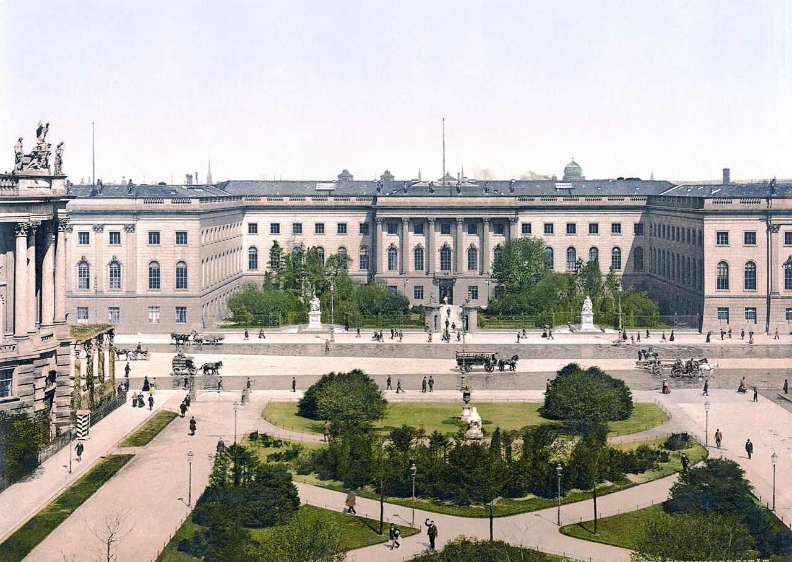

## Academic Freedom: From Humboldt to the Present

::: {.grid}

::: {.g-col-12 .g-col-md-3}

:::

::: {.g-col-12 .g-col-md-9}

[Read in Turkish (manifold.org)](https://www.google.com), &nbsp; [Fall 2023](https://www.google.com)

Can academic freedom truly exist when political power, though not present within institutions, exerts external influence by overtly and subtly determining the permissible scope of academic inquiry?

:::

:::

