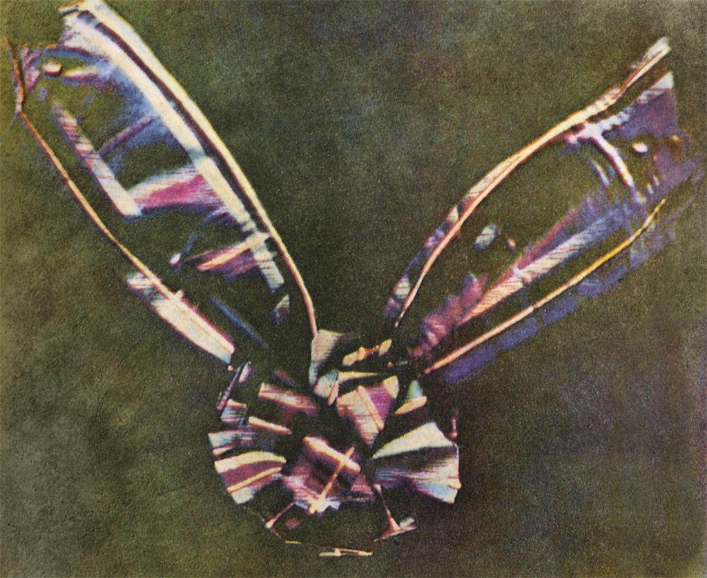
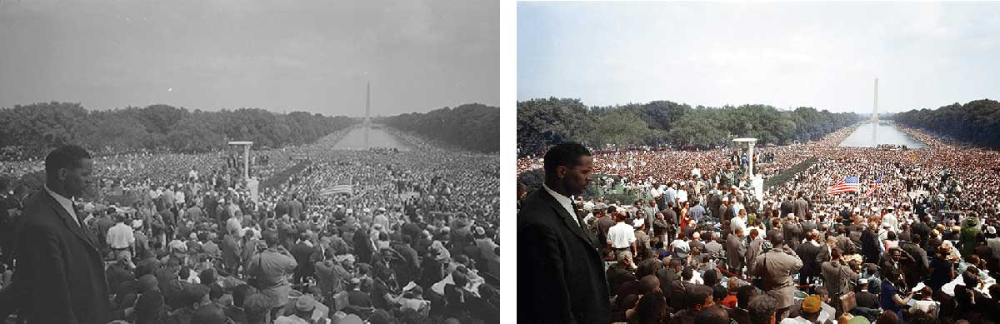
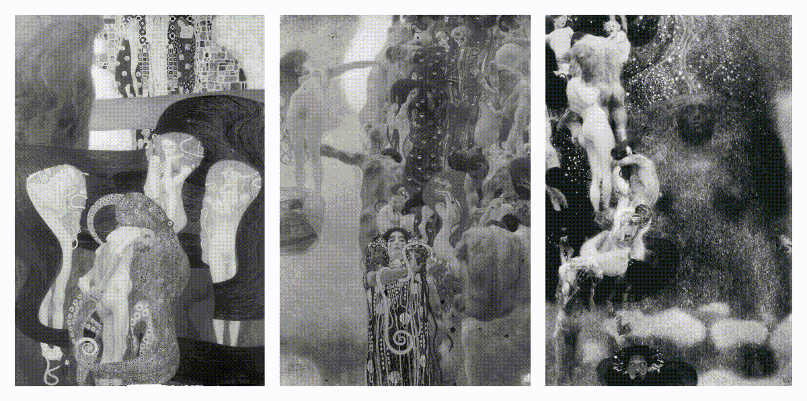
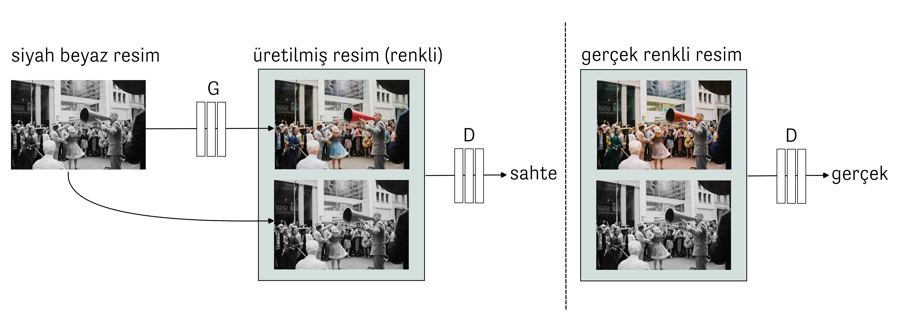
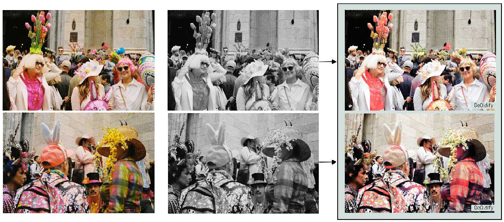
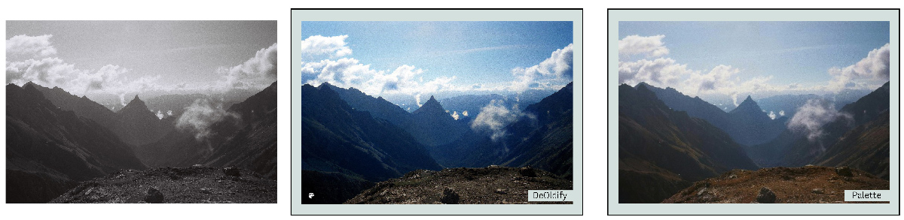

Aside from the mathematical foundations and theory behind it, data science and
computational sciences are helping to make discoveries in different areas of the
basic sciences when we look at their applications. Most of us often pay
attention to the macro or microworlds in everyday life. For example, a newly
discovered planet, the surface of Mars, images of the Earth taken from
satellites, or statistical analyses on the changing structure of a virus. But
what if we look at nature on a different scale and at our cultural heritage as
far as the eye can see? Clay tablets, manuscripts, frescoes, sculptures, and
more. Many have succumbed to the ravages of time and climate: They are missing,
broken, defaced, or damaged by human hands. Human-made damage is not always
barbaric and destructive. Just as in the ancient city of Troy, for example, ten
different cities were built on top of each other; the damage to urban ruins also
resulted from changing cultures and times. We want to clean, restore, make sense
of, and transmit archaeological remains, writings, paintings, and photographs to
the future. Old black and white pictures without color, clay tablets, some of
which are unreadable, fragments of frescoes shattered by earthquakes, and
more... In this post and several to follow, I will discuss the use of technology
to fill in the missing pieces. Let's start with photographs.

## Colors and the Past of Photography

If we look at a painting, color is only a matter of the artist's choice. But how
is it in photography? Is it because there was no technology to record colors in
the past, and that's why old photographs are always black and white or are there
other reasons? Both are true. Color photography technology dates back to 1855.
Scottish physicist James Clerk Maxwell was a young researcher at Edinburgh
University when he became interested in professor James David Forbes' lectures
on color. Maxwell developed a disk using the Young-Helmholtz theory he learned
in these lectures. The human eye perceives all other colors and hues from a
mixture of red (R), green (G), and blue (B) colors of the visible spectrum. So
the Maxwell disk[^1] was a system of disks, not perfectly round in shape, rotating
around an axis like a spinning top. This allowed him to study how the
chromaticity of the colors changed when the disks were mixed. With this system,
which is still used today, the images we see on our screens are expressed as a
combination of these three colors. From 1855 onwards, Maxwell published several
papers about his color experiments. There is also an article on color perception
and color blindness. In this article, he mentions that while experimenting in
the classroom, a student with color blindness was frightened because he
perceived the resulting color differently.

<figure>
    
    <figcaption style="color: gray; font-style: italic;">
        The first color photograph was taken by Thomas Sutton in 1861 using
        James Clerk Maxwell's method , source: 
        <a href="https://en.wikipedia.org/wiki/Color_photography#/media/File:Tartan_Ribbon.jpg">Wikipedia</a>
    </figcaption>
</figure>

Of course, modern color films were developed in the 1930s—the Agfa AG factory in
Wolfen, Germany, especially from 1932 onwards. At that time, these films could
only be used in Leica and Contax cameras. The "Agfacolor-Neu" film was first
announced in 1936 and used at the Berlin Olympics. Agfa's US competitor Eastman
Kodak had also produced "Kodachrome" film for the first time in 1935, but its
initial technique was much more complex. Photography lovers will probably
recognize Kodachrome from Steve MyCurry's famous photograph of an Afghan Girl in
Pakistan in 1985.

Despite all these technological advances, color film was widely used in
photography or cinema in the 1970s. In 2023, there are still photographers who
only take black-and-white photographs. In 2012, Leica released a digital camera
that shoots only in black and white: Leica M Monochrom. Therefore, one cannot
help but ask: Why? Undoubtedly, we can attribute the avoidance of color film for
decades to the fact that the chemical processes and colors used at the time were
spurious and far from the desired quality (low speed affecting sharpness and
depth of field). According to Henri Cartier-Bresson, one of the founders of
Magnum and even street photography, the real story of photography was to express
an unexpected moment in a composition in an arbitrary or unprecedented way.
The term he coined, *decisive moments*. Working in black and white allows us to
be abstract from colors and concentrate on composition, light, and the essential
elements of photography. Bresson is not the only one who remained in black and
white. There are such legendary names; as Ansel Adams, Robert Capa, Fan Ho, and
others. Perhaps they were looking at the world from the same point of view as
the impressionist painter Pierre-Auguste Renoir: "For forty years, I have been
discovering that the queen of all colors is black."

Moving from artistic choices to the technical side of the issue, we have maybe
half a century of history that we have photographed in black and white in large
numbers, and the question is: Is it possible to bring back the colors that are
missing in old photographs from a specific period?

## From Black and White Photography to Colors 

You may have seen colorized photographs on social media, in a news article, a
news article, or even a book. These photos are done mainly by "colorists" who
work in fields that require knowledge and application of colors, such as
painting and fashion design. I have seen such photographs for a long time, but
my curiosity and research started when I saw Jordan Lloyd's work. Wolfgang Wild
and Jordan Lloyd's History as They Saw It: Iconic Moments From the Past in
Color[^2] by Wolfgang Wild and Jordan Lloyd consists of 120 historically
significant photographs colored by Jordan Lloyd, along with small information
notes about these photographs. From Dorothea Lange's famous picture of Mother
Migrant to August Landmesser refusing to give the Nazi salute in a crowd in
1936, the book includes exciting photographs, from battlefields to portraits.
Those interested can buy Lloyd's book Colours Of London: A History or his
website.

<figure>
    

    
    

    <figcaption style="color: gray; font-style: italic;">
        A picture of a historic day: Civil Rights movement march on Washington
        for jobs and freedom. A view of the crowds on August 28, 1963,
        the day Martin Luther King delivered his **"I have a Dream"** speech,
        sources:
        <a href="https://www.loc.gov/resource/ds.04417/">LOC</a> and 
        <a href="https://unsplash.com/photos/4kYkKW8v8rY">Unsplash</a>
    </figcaption>
</figure>

Colorizing photographs is a laborious process that takes time and research.
Colorization artists start by removing scratches from high-resolution digital
copies of the photographs. Then, in the restoration process, objects, clothes,
faces, and other parts that are thought to have different colors are layered.
There may be a watch or a piece of furniture in the photograph, and it is
possible to see them in a museum to be sure of their authentic color tones. This
part is like history and archival research. Then all this information is
processed in different layers and combined according to the time and light
conditions in which the photograph was taken. Now let's take a closer look at a
very recent example of artificial intelligence used in the colorization process,
and let's go to Vienna.

## AI in Coloring: Gustav Klimt's Faculty Paintings

In 1893, the University of Vienna commissioned the famous Austrian painter
Gustav Klimt to create three paintings representing the faculties of law,
medicine, and philosophy[^3]. When Klimt produced the paintings, and it was time
for the exhibition, all hell broke loose. The old bodies and nudity in the
paintings were deemed "disturbing." The faculty paintings turned into a
political debate. Unable to accept this situation, Klimt returned the money he
had received and took his paintings back. Unfortunately, in 1945, Klimt's
faculty paintings were destroyed in a fire set by the retreating German army in
the last days of World War II. Only black and white photographs of these three
paintings remain, and this is where the story of colorization begins.

<figure>
    

    
    

    <figcaption style="color: gray; font-style: italic;">
        Colored animation from black and white photographs of Gustav Klimt's faculty
        paintings. Courtesy of Emil Wallner and Google Arts & Culture
    </figcaption>
</figure>

In 2021, a project was launched in collaboration with the Belvedere Museum in
Vienna and Google Arts & Culture[^4]. Dr. Franz Smola, curator of the Belvedere
Museum, determined the colors based on other paintings by Klimt and historical
information. Emil Wallner, an engineer and machine learning expert, conducted
deep learning experiments as part of Google Arts & Culture's residency program
in Paris, converting thousands of black and white paintings into color. Above,
you can see the moving pictures of faculty paintings that went from black and
white to color. Let's talk about the artificial intelligence part of this
colorization.

We mentioned that all colors except primary colors are a mixture of red (R),
green (G), and blue (B). A color image is made up of pixels, and each pixel has
three numerical values with a value between 0 and 255. In black and white, a
pixel is represented by a single number: 0 is the darkest black, 255 is white,
and in between, the shades. Colorizing a black-and-white picture means three
times as much information as we have. Machine learning is a sub-branch of the
field we always hear about artificial intelligence today. Here, we solve the
colorization problem with deep learning, a machine learning method. What we call
learning is recognizing labels we already know in a training set (for example, a
certain number of images). This is done by setting a goal and using a
back-propagation algorithm to minimize the error value at each step. Ultimately,
we are interested in the model we train to predict those labels in different
test samples. Returning to Klimt, our training set is thousands, even hundreds,
or millions of images, both in black and white and in color (and if we have
color, we can easily make it black and white).

Making black and white images in color is a problem in deep learning called
"image-to-image translation." In this project, the starting point was a method
called "pix2pix "[^5]. What doesn't this method (and its successors) translate?
Maps to satellite images, a sketch of a bag or a pair of shoes to a painting, or
a picture of winter to summer... Another method applied in a similar article
makes the translation more reasonable by asking the user for their color
preference at specific points[^6]. Still, deep learning algorithms can only look
holistically if they take patches in a certain size at each step. At this point,
Romain Cazier, another engineer and designer working for Google designed an
interface that allows the user to change the initial coloring produced by the
algorithm. After that, it's domain knowledge: Dr. Smola uses his color expertise
and historical knowledge to refine the colorized images further.

<figure>
    

    
    

    <figcaption style="color: gray; font-style: italic;">
        Colorizing black and white images with adversarial generative models: An
        example of how the "pix2pix" method works, image: Ömer Sümer
    </figcaption>
</figure>

Here, let's take a break from Klimt's faculty paintings and briefly examine the
figure to see how these deep learning methods work. We have a black-and-white
image that we also have in color. There are two networks with millions of
parameters that we want to train on hundreds of thousands or even millions of
images: The generator (G) and the discriminator (D). The generator tries to
color the given black-and-white images as realistically as possible. The
discriminator determines whether the given pairs of black-and-white and color
pictures are real or fake. These two networks try to outperform each other or,
more technically, reduce the error value according to a loss function. In the
end, we see more realistic color images. Nowadays, there are generative deep
learning methods that work with different approaches and perform better.
However, "pix2pix", which we briefly described, is one of the first deep
learning-based methods for colorizing black and white images [artistic style
transfer].

Now let's go back to the colorization of historical photographs, Klimt's faculty
paintings. Designers may wonder, "Will this AI soon take over our work?" Do we,
as AI researchers, want to solve this problem entirely with algorithms? I asked
Emil Wallner, based on his experience with the Klimt project, and his answer was
as follows:

> "Many professional colorists use the AI-generated output as a base layer. They
then correct details and historical accuracy. However, AI is particularly good
at reproducing natural skin tones and lighting conditions."

This shows that coloring is not just a matter of algorithms. This technology is
there to help designers and colorists, and humans are always involved. By the
way, Emil has further developed his coloring model into an online tool. It's
called Palette, and I tested it on a few black-and-white photos I took myself.
It's possible to adjust them in different styles and shades of color and even
edit them with text, describing things in the image with the adjectives we want.
You can try and test it too.

<figure>
    

    
    

    <figcaption style="color: gray; font-style: italic;">
        Original color pictures (left), converted to black and white (middle)
        and colorized versions (right), Easter parade in New York City, 2019,
        photo: Ömer Sümer
    </figcaption>
</figure>

<figure>
    

    
    

    <figcaption style="color: gray; font-style: italic;">
        Colorized versions of an original black and white nature photograph
        using two different models called DeOldify and Palette, Austrian Alps,
        2022, photo: Ömer Sümer
    </figcaption>
</figure>

Above, you see a couple of analog photos I took myself. In the first one, I
chose two pictures from the Easter parade in New York City. The clothes and
colors were unexpected and hard to predict, so I wanted to see how colorizing
already colored photos in black and white worked out. The human faces and skin
tones work well—even the more usual colored clothes. But the artificial flowers
and colorful costumes look different from the originals. The primary reason is
that the deep learning methods are trained on a particular training set
(probably more common, uniform colors), so what we see in the test images is
similar to those samples. There is a bias. The second image is an
easier-to-predict nature photo and has a black-and-white original. Both of the
different methods I tried on this photo worked well.

In this article, we started to fill in the gaps by bringing back the colors.
Colorization is not as easy a problem as it seems from afar. It is not something
to be left entirely to algorithms. However, this is an excellent example of
human-artificial intelligence interaction.

[^1]: Disks from James Clerk Maxwell's colour top, National Museums Scotland.

[^2]: Jordan Lloyd ve Wolfgang Wild, *History as They Saw It: Iconic Moments From the Past in Color* (Chronicle Books, 2018).

[^3]: 1894–1905: Faculty Paintings Scandal, Gustav Klimt Foundation.

[^4]: The Klimt Color Enigma, Colorizing Klimt’s Vanished Paintings with Artificial Intelligence and Klimt Experts, Google Arts and Culture.

[^5]: Phillip Isola, vd. “Image-to-Image Translation with Conditional Adversarial Networks”, Proceedings of the IEEE Conference on Computer Vision and Pattern Recognition, 2017.

[^6]: Richard Zhang, vd. “Real-time User-Guided Image Colorization with Learned Deep Priors”, ACM Transactions on Graphics, 36.4 (2017): 119.

