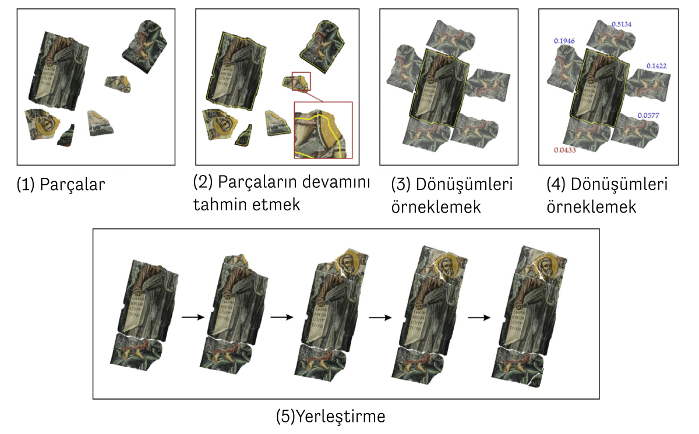
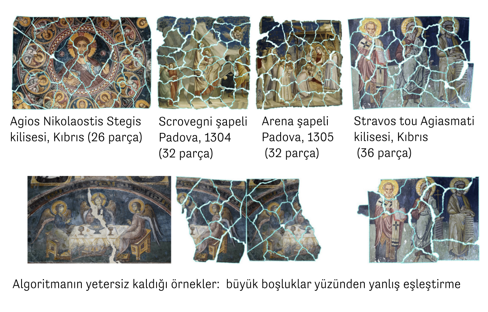
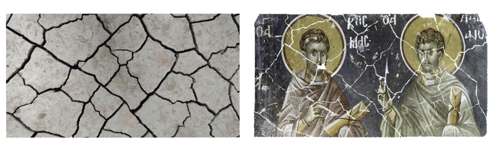
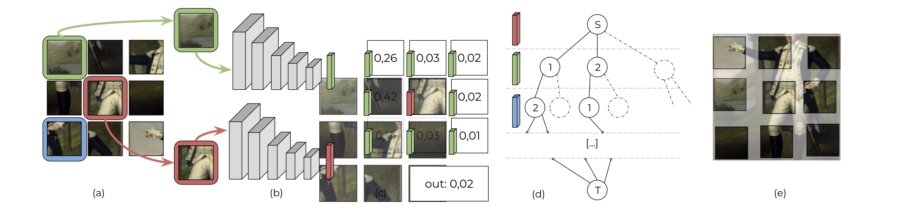
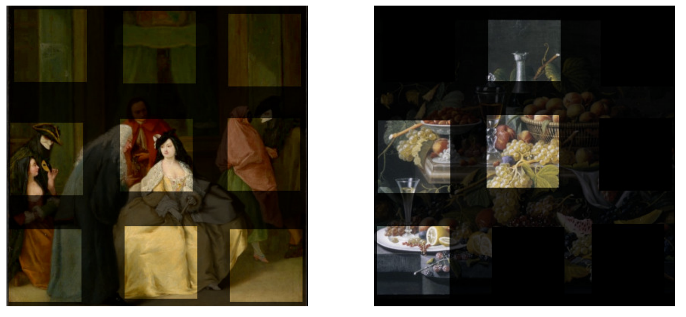

Although it may seem like a game or a leisure activity, solving puzzles is a
serious business. From biology to chemistry, from medicine to the analysis of
ancient documents, and even archaeology, solving puzzles interests many
different fields. For example, DNA sequencing in bioinformatics or finding
molecular structures with desired properties in computational chemistry are
puzzles. Puzzles are solved in different ways. Let's look at one of the most
well-known ones, the jigsaw puzzle. No algorithm determines whether a given
jigsaw puzzle has a solution and, if it does, how long it takes to solve it. In
other words, solving a jigsaw puzzle is an "NP-complete "[^1] complexity problem,
just like the "traveling salesman" problem[^2]. Let us continue completing the
missing pieces that we started with colors in the previous article by solving
puzzles in cultural heritage conservation and archaeology.

## Reconstructing a Fresco from its Broken Pieces 
On a puzzle box, we see the picture we will get if we manage to make it. The
most challenging thing about solving a fresco from its broken pieces is, above
all, that we have probably never seen the picture they form before. Of course,
the difficulties of solving archaeological puzzles are not limited to this. The
fragments could be in any shape. Broken by natural factors, earthquakes, or
man-made, they are not standardized like a jigsaw puzzle set. They are worn at
the edges and corners, where we would expect them to be uniform in color. There
are also missing pieces. The transformation between the parts is continuous.
There may be not just two pieces but many pieces that fit together in a way that
seems right.

A study3 by researchers Niv Derech, Ayellet Tal, and Ilan Shimshoni from the
Technion and the University of Haifa in Israel brings several innovations to the
solution of archaeological puzzles. Just as interesting as their mathematical
approach is that their proposed method can accurately solve puzzles constructed
from different, authentic fresco patterns. Let's take a look at the details of
this work together.

According to Derech and colleagues, three features make archaeological puzzles
difficult: The first is wear. Abrasion causes gaps to remain between the joined
pieces. The second is fading colors. Since color is essential information for
understanding whether two pieces are related, it must be usable despite fading.
The third is that the current transformation between each part is continuous. So
we can put it like this: We don't have a frame on which to place the pieces, and
we don't have a grid (or a sieve) on which all the pieces sit. Each piece can
rotate in any direction and be placed a few millimeters to the right, left, up,
or down.

<figure>
    
    <figcaption style="color: gray; font-style: italic;">
        The method of solving archaeological puzzles in "Solving
        archaeological puzzles"[^3].
    </figcaption>
</figure>

Now, let's look at the methodology for solving archaeological puzzles used in
this study, summarized in the figure above. The first step is to guess the
continuation of the fragments. The existing pieces may be partially damaged,
with missing edges and corners. In the first step, they predict and expand the
continuation of these fragments in small strips around them. It does this by
solving an optimization problem that takes into account the color and texture
variation of each fragment, as well as its shape and photometric properties.
Since the colors present in a fresco fragment are already limited, this method
uses only the colors in the main fragment to predict the continuation of the
fragments.

Once the edges of the pieces are slightly widened, the next step is to start
experimenting. In the same way that when we start solving a puzzle, we try to
see if two pieces fit together, at this stage, a series of suggestions are made
based on similarities in color and shape. Of course, not all of these suggested
transformations will be the right solution, but we will try to choose the right
one.

As we mentioned earlier, finding perfect matches in archaeological puzzles is
often impossible. If the pieces are already perfectly matched, it's likely that
humans will quickly solve this problem, and there would be no need for such an
algorithm. So this step is to create a "difference value" for each valid
transformation sampled earlier. This numerical value expresses how mismatched
the two parts are in their proposed relative positions. For an incompatible
transformation, it will have a reasonably high value. The goal of the
mathematical optimization will be to minimize this dissimilarity value. In this
way, we can find transformations with a small dissimilarity value that
complement each other in color and shape and find good matches.

The final step is to use the dissimilarity values calculated in the previous
step to combine the pieces in sequence, starting with one piece. Often, the
original size of the fresco and the wall where the fragments are located is
known, so this information is also used.

<figure>
    

    
    

    <figcaption style="color: gray; font-style: italic;">
        Examples of archaeological puzzles solved in "Solving archaeological puzzles".
    </figcaption>
</figure>

In the image above, examples of puzzles are solved by following these steps. The
examples in the top row are the successful ones. What they have in common is
that there are no significant gaps between them. The fresco in the second row
has a very large gap in the center. That's why the algorithm couldn't place the
left and right sides of the table correctly.

<figure>
    

    
    
 <figcaption style="color: gray; font-style: italic;">
        In the study titled "Solving archaeological puzzles", dry mud
        texture and fresco fragments synthetically produced from these
        fractures".
    </figcaption>
</figure>

The frescoes and paintings in the figure and the other examples in this work
were originally taken from different churches and the British Museum
collections. However, the pieces are not authentic. They produced pieces to
simulate the fractures on dry clay and synthetically made the fresco fractures
accordingly. The use of dry clay shards is directly related to the method of
making the frescoes. Although this method has been used since antiquity, it was
developed in Italy in the 13th century and became one of the symbols of the
Renaissance: Two layers of plaster are applied to the wall to be painted, and on
the second layer, the design to be painted is drawn in general outline. Before
the top layer of plaster is completely dry, the entire surface is painted with
water-based paint while it is still wet. Since it has to be done wet, the artist
who paints frescoes usually prepares as much plaster as he can paint in one day.
After all, fresco [fresco] means fresh in Italian. That's why they simulate
fractures with fractures as if a clay surface had been frozen and broken.
Damaged frescoes can also be deformed similarly to the textures on dried clay.

## Learning from Data: Is Better Possible?

Reassembling frescoes and solving them like a puzzle can be seen as a
reconstruction technique used in restoration, a form of anastylosis. The
archaeological term anastylosis (αναστήλωσις) is made up of two words in ancient
Greek, meaning "again" and "to sew." It is used to restore historical artifacts
that have been damaged over time, from large columns to pottery or smaller works
of art. As in the case of the frescoes, we saw how the pieces were placed
digitally using mathematical methods.

The previous study uses the similarities in color and shape of the pieces to
solve a puzzle based on the number of pieces, for example, 36 pieces, in 200
minutes. Machine learning and deep learning, a sub-branch of artificial
intelligence, offer this possibility in thousands or millions of examples.
Although machine learning methods do not work well for combinatorial problems
such as "crossword puzzles" and are insufficient on their own, it is worth
considering whether they could help solve archaeological puzzles. Can we train
deep learning models on other examples of frescoes or paintings from similar
periods, made of similar materials and colors, to place them from their
fragments?

Yes, there are efforts in this direction. The Deepzzle method[^4] [^5], whose working
diagram is shown in the figure below, was trained on a dataset of 14,000
photographs and paintings shared by the Metropolitan Museum of Art in New York
under an open access policy[^6]. The images are divided into 3 × 3 pieces. In the
first stage, a deep learning model is trained to predict the relative
relationship (above, below, to the right, or the left) between the centerpiece
and a given other piece. In the second stage, the fragments and the
probabilities predicted by the deep learning method are used to create
structures called graphs. Graphs consist of nodes and edges connecting these
nodes. Then, the shortest path optimization solved on the graphs gives the
optimal placement.

<figure>
    

    
    
 <figcaption style="color: gray; font-style: italic;">
        Solving visual jigsaw puzzles with deep learning and shortest
        path optimization", the solution of 3 × 3 visual jigsaw puzzles with
        Deepzzle method
    </figcaption>
</figure>

At first, solving 3 × 3 puzzles in the Deepzzle method seems easier than the
previous work. Also, the pieces are square. However, learning this problem from
thousands of images, i.e., "learning from data," has advantages over solving it
by combinatorial optimization alone. By using machine learning methods on a data
set similar to a fresco, pottery shards, or paintings we want to solve, we learn
the spatial similarity between the pieces, allowing us to make better
placements.

<figure>
    

    
    
 <figcaption style="color: gray; font-style: italic;">
        Two examples solved with the Deepzzle method: In the picture on the
        right, the algorithm has correctly ordered the given pieces despite five
        missing pieces.
    </figcaption>
</figure>

## Conclusion

This article approached solving archaeological puzzles as an example of digital
anastylosis. We have seen it in two-dimensional examples in frescoes or
digitized paintings. Similar methods are also used for the computer-based
completion of three-dimensional archaeological objects. Recovering a lost fresco
where the fragments are badly damaged, and there are many of them, is a
challenging problem. Nevertheless, it is exciting to see developments in this
direction. Although experts often do restoration, that is, by human hands, the
technologies we have examined can speed up these processes and complete parts
that are not easily recognizable to the human eye.

[^1]: "Computational complexity" in theoretical computer science and discrete
mathematics theory" is interested in how much time and resources a computational
problem can be solved. Regardless of the algorithm used in the solution, some
problems are inherently more challenging. The abbreviation used here is NP
[Nondeterministic, Polynomial time] refers to a class of complexity. It is the
set of problems whose solutions can be verified in a certain (polynomial) time.
Group of NP, the most difficult type of complexity problem is the so-called
NP-complete problem. They cannot be solved in polynomial time. As computational
problem puzzles are also NP-complete complexity problems. Jigsaw puzzles For
more information on the complexity of the complexity, see: Erik D. Demaine ve
Martin L. Demaine. “Jigsaw puzzles, edge matching, and polyomino packing:
Connections and complexity.” Graphs and Combinatorics 23. Suppl 1 (2007):
195-208. https://link.springer.com/article/10.1007/s00373-007-0713-4

[^2]: The Traveling Salesman Problem (TSP) is as follows: A salesman wants to
tour "n" different cities. Each city can be visited only once, and the objective
is to find the shortest path. From logistics to electronic circuit production,
even DNA, there are many fields of applications for TSP algorithms. Like
puzzles, the traveling salesman problem has NP-complete complexity. For more
information, see Wikipedia:
https://en.wikipedia.org/wiki/Travelling_salesman_problem

[^3]: Niv Derech, Ayellet Tal ve Ilan Shimshoni. “Solving archaeological puzzles.”
Pattern Recognition 119 (2021): 108065.

[^4]: Marie-Morgane Paumard, David Picard ve Hedi Tabia. “Jigsaw puzzle solving
using local feature co-occurrences in deep neural networks.” 25th IEEE
International Conference on Image Processing (ICIP). IEEE, 2018.

[^5]: Marie-Morgane Paumard, David Picard ve Hedi Tabia. “Deepzzle: Solving visual
jigsaw puzzles with deep learning and shortest path optimization.” IEEE
Transactions on Image Processing 29 (2020): 3569-3581.

[^6]: Metropolitan Sanat Müzesi’nin açık erişim politikasıyla paylaştığı belgeleri
incelemek için bkz. The Met.