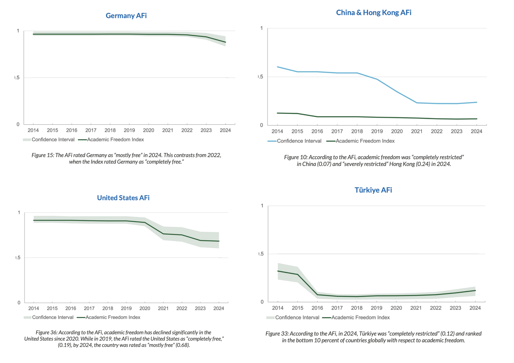

:::{.dropcap}
Today, university education and academia function as more than pathways to professional qualification; they serve as primary engines of intellectual advancement and societal progress. Universities generate research, discovery, and innovation across diverse fields, contributing significantly to both humanity and the societies from which they arise. Despite these contributions, significant challenges to academic autonomy and freedom of expression persist, even in relatively robust democracies. The history of academic freedom and the modern university spans only approximately two centuries. Although these concepts may appear abstract, they continue to influence daily student experiences, from curriculum design and participation in seminar courses to the difficulties encountered when addressing controversial topics in the classroom. In this article, I provide a historical perspective, beginning with the educational reforms of Wilhelm von Humboldt, and demonstrate how these developments continue to shape contemporary academic environments.
:::

The oldest continuously operating universities are primarily located in Continental Europe and Great Britain, including Bologna, Oxford, Cambridge, and Heidelberg, with founding dates between the 11th and 14th centuries. Although universities in the Islamic world, such as al-Qarawiyyin (Morocco), Ez-Zitouna (Tunisia), and Al-Azhar (Egypt), predate their European counterparts and are rooted in the madrasa system, their structures differ from the European model. Even if the origins of the university are traced to these European institutions, and ancient centers in Egypt, Rome, and China are excluded, it is challenging to assert that these early universities were centers of “science” and “research” as understood today. They primarily functioned as schools of theology, law, and medicine, were supported by local rulers or aristocratic families, and lacked institutional independence.

Wilhelm and Alexander von Humboldt were born into a Prussian aristocratic family in 1767 and 1769, respectively. Their father served as a general in the Prussian army, and their mother was of Huguenot descent. The Huguenots, a significant Calvinist Protestant community, fled France due to persecution and were welcomed in Brandenburg by Prussia. Neither brother attended formal schooling; instead, they received a liberal education from private tutors. While Alexander von Humboldt is renowned for his contributions to geography, natural history, and exploration, Wilhelm von Humboldt’s educational reforms profoundly influenced universities in Germany, Continental Europe, the United Kingdom, and the United States. Notably, although Wilhelm von Humboldt studied at Frankfurt an der Oder and Göttingen, he did not complete a degree and was, in effect, a “*dropout*.” [^1]

The Prussian model emerged as a central force in scientific advancement, extending its influence internationally. In the 19th century, over 10,000 American researchers traveled to Prussia for doctoral studies, as most American universities did not yet offer PhD programs. At that time, university education primarily emphasized the transmission of established knowledge rather than original research. The two core principles that attracted these researchers to Prussian universities —*scientific freedom and the integration of teaching and research*— subsequently inspired reforms in American higher education. [^2]

What is meant by scientific freedom is multi-layered. Before the 19th century, the patron authority of a university had the right to hire or fire any professor without consulting the faculty or other scholars in that discipline. Often, the churches and religious communities that funded the university and provided student scholarships felt entitled to interfere with the curriculum. Professors were encouraged to write textbooks to disseminate existing knowledge rather than to conduct new research and publish the results. In fact, terms like “discovery,” “invention,” or “improvement” were used far more frequently than the word “research” itself.

After Prussia’s defeat in the Napoleonic Wars, the state undertook a series of reforms aimed at understanding its shortcomings and fostering moral renewal, with education as a central focus. Frederick William III established a new university in Berlin, appointing Chancellor Hardenberg and Wilhelm von Humboldt, Director of the Department of Public Instruction and Religious Affairs, to lead the reform. Prior to this appointment, Humboldt argued in his essay “On the Limits of State Action” (*Ideen zu einem Versuch, die Grenzen der Wirksamkeit des Staats zu bestimmen*) that self-actualization is the primary human motivation, and that freedom is essential for its realization. As individuals pursue their potential, they develop unique competencies that ultimately benefit society. Consequently, any state that restricts individual aspirations and abilities diminishes itself and reduces its citizens to mere subjects (*Untertanen*). This principle remains highly relevant, even as some states continue to adopt more repressive approaches.

Upon assuming office in 1809, Humboldt assembled a team and developed a concept paper detailing reforms for primary, secondary, and higher education. Although he resigned soon after due to bureaucratic obstacles and a subordinate position within the ministry, many of his proposals were implemented. These included compulsory primary education, mandatory state examinations for secondary school teachers, a standardized curriculum, and the introduction of the Abitur examination at the conclusion of secondary education. Humboldt also recruited and appointed distinguished researchers and professors to the newly established University of Berlin.

A closer examination of the university’s function within the Humboldtian model reveals that higher education is designed to foster self-confident individuals and global citizens by providing comprehensive education (*Bildung*). The primary objective is not to address the immediate needs of the state or society, nor is it solely focused on employment or vocational training.

In current practice, many professions that are university departments in other countries are acquired in Germany through vocational training (*Ausbildung*), with standards set by the state and professional associations. Universities of Applied Sciences (*Hochschulen*) design curricula to meet the needs of local industries, emphasizing employment-oriented education. However, rapid technological advancement, the neoliberal university model, and reforms introduced by the EU’s Bologna Process since the 2000s have shifted universities away from the Humboldtian ideal. The Bologna Process, for instance, implemented a modular, tiered degree structure (Bachelor’s and Master’s), replacing traditional long-cycle Diplom or Magister programs. This transition resulted in more rigid curricula and standardized credit systems, such as ECTS, often at the expense of academic freedom and self-directed learning. Additionally, some countries introduced or increased tuition fees and shifted toward short-term, project-based research funding rather than stable governmental support. These reforms have prioritized employability, efficiency, and competition over the original mission of holistic personal development and independent scholarship. [^3]

Humboldt positioned his educational model as an alternative to the French system, which featured *Grandes Écoles* specializing in distinct academic disciplines. While Humboldt sought to cultivate the personality of a free individual through education, the French approach emphasized the development of esprit de corps. French universities traditionally maintained rigid curricula, whereas the Humboldtian system prioritized seminars that encouraged students to participate actively rather than remain passive listeners. These seminars are essential for fostering critical discussion and developing a scientific perspective; they remain integral to undergraduate and graduate education in German universities. Over the past century, French universities and prestigious institutions outside Continental Europe, including Cambridge, Oxford, Johns Hopkins, and Chicago, have also adopted this seminar culture. Notably, Stanford University’s motto, “The wind of freedom blows” (*Die Luft der Freiheit weht*), reflects inspiration from Humboldtian reform.

Within the Humboldtian system, with the exception of regulated fields such as law and medicine, students possess the freedom to select courses and design curricula aligned with their personal development and career objectives (freedom of learning, *Lernfreiheit*). They may also attend courses at other universities. Complementing this is the freedom of teaching, whereby professors determine the subjects and content of their courses within their areas of expertise (freedom of teaching, *Lehrfreiheit*). Teaching and research are regarded as inseparable activities (unity of research and teaching). According to this perspective, universities and academic institutions distinguish themselves from schools by focusing on unresolved problems and conducting research to address them.

The phrase “Science and its teaching are free” (Die Wissenschaft und ihre Lehre ist frei) appeared in Paragraph 152 of the catalogue of fundamental rights adopted at the Frankfurt Paulskirche in 1848, which formed the basis for the first German constitution (*Paulskirchenverfassung*). Although this constitution was never fully enacted, it significantly influenced the later Weimar Constitution and the current German Basic Law (*Grundgesetz*). Max Weber’s views were consistent with the Humboldtian system; in a well-known lecture, he emphasized the necessity of instructor neutrality and argued that politics should not enter the lecture hall. According to Weber, professors should refrain from imposing their political views in settings where students cannot effectively challenge them. During the Third Reich (1933–1945), German academia diverged sharply from these freedoms. Heidegger’s 1933 speech as rector of Freiburg University exemplified this shift, as he declared academic freedom “fake,” with only negative connotations, and advocated its removal from German universities. After World War II, figures such as Karl Jaspers, Gerhard Ritter, and Werner Richter played pivotal roles in restructuring German universities, adapting Humboldtian principles of research freedom and the pursuit of truth to postwar conditions.

A significant gap exists between the ideals of academic neutrality and the realities of contemporary academia. In principle, few would contest Weber’s assertion that politics should remain outside the lecture hall. However, even Weber did not envision scientists as entirely devoid of values; rather, he advocated for the discipline to separate personal convictions from scientific analysis. In practice, maintaining this separation is challenging. Researchers and instructors inevitably carry values shaped by family, environment, and personal experience, which cannot be discarded at will. Nevertheless, the inability to fully detach from personal values does not justify adopting the role of spokesperson for a particular social group or political position. Awareness of one’s values is distinct from allowing them to dictate research and teaching agendas.

::: {style="text-align: left;"}

The change over the years in the Academic Freedom Index for four selected countries  
— *Germany, the USA, China & Hong Kong, and Turkey*.  
**Source:** Free To Think 2025 [^7] and regarding the calculation of the Academic Freedom Index [^8].
:::

Beyond the challenges of values and neutrality, the question arises whether academic freedom can be fully encapsulated by the concepts of *Lernfreiheit* and *Lehrfreiheit* as defined in the Humboldtian system.

Granting professors tenure and protecting their autonomy in research and teaching is a crucial foundation for academic freedom. However, professors typically lead research teams composed of doctoral students and postdoctoral researchers, for whom they serve as mentors and project managers. In the current scientific landscape, innovation often results from interdisciplinary, national, and international collaboration rather than individual effort. Funding for these teams and their research infrastructure is primarily provided by state-sponsored programs and, to a lesser extent, industry grants. This arrangement creates a parallel to the scholastic era, where direct church intervention has been replaced by indirect but effective control through funding mechanisms. States and private entities now influence research agendas by determining which projects receive financial support. For example, in computer science, proposals in theoretical areas or subfields of artificial intelligence outside of deep learning are less likely to secure funding compared to projects on trending topics such as Large Language Models. This dynamic incentivizes researchers to pursue market-driven topics rather than those driven by intellectual curiosity. Similar funding pressures exist in the humanities and social sciences, where projects related to technology, digital humanities, or contemporary political issues are favored over research on classical literature or abstract philosophical questions. Grants in the social sciences often prioritize studies with immediate policy relevance, making it difficult for more fundamental or critical research to obtain resources. As a result, scholars across disciplines are compelled to align their work with funders’ interests, sometimes at the expense of academic freedom and intellectual diversity. The neoliberal university model, which evaluates research primarily by its marketability, undermines the foundational principles of the Humboldtian system.

This dependency is not solely utilitarian or employment-oriented; it also encompasses a pronounced ideological dimension. This is exemplified by the actions of the Trump administration, which threatened or reduced billions of dollars in research funding to elite universities such as Harvard, Columbia, and Penn. These measures were driven by political populism, which labeled inclusivity initiatives (Diversity, Equity, Inclusion, DEI) as “woke” and characterized criticism of Israel’s genocidal actions in Gaza as inherently antisemitic [^4] [^5]. Similar conflicts are evident in Europe, where researchers have been dismissed for social media activity, even when such posts do not constitute legally defined offenses [^6]. In Turkey, the situation is even more acute, with the case of Boğaziçi University standing out among numerous examples. Alignment with political authorities secures research funding, while dissent leads to punitive measures such as course cancellations, tenure revocation, and various forms of workplace harassment. Despite variations in severity, the underlying issue remains consistent: political influence operates externally, exerting pressure on academics and constraining their autonomy. Under these conditions, the very notion of academic freedom is called into question.

> Humboldt asserted that self-actualization is the primary human motivation and that freedom is essential to its realization. This principle remains relevant today. Academic freedom extends beyond the ability of professors to select courses or students to design curricula; it reflects a society’s commitment to the pursuit of truth. While research and higher education are inevitably connected to contemporary issues, production, and politics, subordinating them to market forces, political agendas, or populist pressures undermines not only the university but also the society’s capacity for self-understanding and renewal.

***Note:** This text was first published in Turkish by [Manifold.org](https://manifold.press/humboldt-tan-bugune-akademik-ozgurluk). The version presented here is a loose translation of the original article.*

[^1]: Johan Östling, “[Humboldt and the Modern German University: An Intellectual History](https://www.lunduniversitypress.lu.se/books/9307298/)” (2018): 1–312.
[^2]: Steven Muller, “[Wilhelm von Humboldt and the University in the United States](https://secwww.jhuapl.edu/techdigest/Content/techdigest/pdf/V06-N03/06-03-Muller.pdf)”, *Johns Hopkins APL Technical Digest* 6(3) (1985): 253–256.
[^3]: Jan C. Bongaerts, “[The Humboldtian Model of Higher Education and Its Significance for the European University on Responsible Consumption and Production](https://doi.org/10.1007/s00501-022-01280-w)”, *BHM Berg- und Hüttenmännische Monatshefte* 167(10) (2022): 500–507.
[^4]: The Guardian, [*Global academic freedom group warns Trump is dismantling US higher education*](https://www.theguardian.com/us-news/2025/oct/01/academic-freedom-us), 1 October 2025.
[^5]: The New Yorker, [*Inside the Trump Administration’s Assault on Higher Education*](https://www.newyorker.com/magazine/2025/10/20/inside-the-trump-administrations-assault-on-higher-education), 13 October 2025.
[^6]: Matt Fitzpatrick, [*As the war in Gaza continues, Germany’s unstinting defence of Israel has unleashed a culture war that has just reached Australia*](https://theconversation.com/as-the-war-in-gaza-continues-germanys-unstinting-defence-of-israel-has-unleashed-a-culture-war-that-has-just-reached-australia-223329), The Conversation, 13 February 2024.
[^7]: Scholars at Risk, [*Free to Think Report of the Scholars at Risk Academic Freedom Monitoring Project*](https://www.scholarsatrisk.org/free-to-think-reports/), 2024 and 2025 reports.
[^8]: Katrin Kinzelbach, Staffan I. Lindberg, Lars Lott, and Angelo Vito Panaro. [*Academic Freedom Index 2025 Update*](https://academic-freedom-index.net/research/Academic_Freedom_Index_Update_2025.pdf). FAU Erlangen-Nürnberg and V-Dem Institute. doi:10.25593/open-fau-1637.