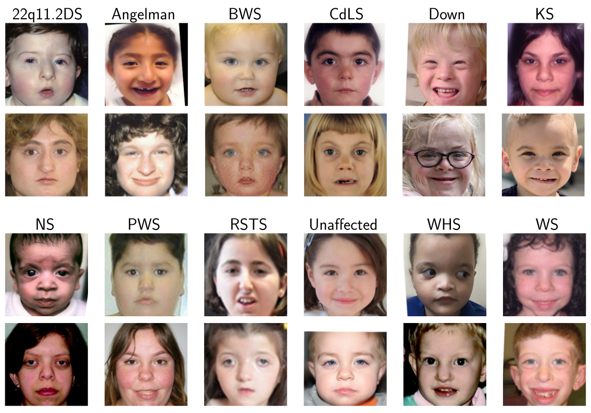

### Recent Projects
---

### Deep Facial Phenotyping 

::: columns
::: {.column width="27.5%"}

:::
::: {.column width="2.5%"}
:::

::: {.column width="70%"}
 
Ö. Sümer, R. L. Waikel, S. E. L. Hanchard, D. Duong, P. Krawitz, C. Conati, B. D. Solomon, E. André “Region-based saliency explanations on the recognition of facial genetic syndromes,” in *Machine learning for healthcare conference*, PMLR, 2023.
 

[`Paper`](https://drive.google.com/file/d/1273q8xznRlE4kVUZ-T7c6X_HSdR69RvM/view?usp=share_link) 
[`Poster`](https://drive.google.com/file/d/1-g4-KXJv0Z_jAShyBFo1f5GF85I1acO3/view?usp=share_link) 
[`Database`](https://zenodo.org/record/8209022) 
[`Code`](https://github.com/sumeromer/facial-gestalt-xai)
:::

::: {style="font-size: small;font-family: Gill Sans, open serif;"}
**Abstract:**
Deep neural networks in computer vision have shown remarkable progress in recogniz- ing facial genetic syndromes. Many genetic syndromes are difficult to detect, even for experienced clinicians, and computer-aided phenotyping can accelerate clinical diagnosis. High-stakes clinical tasks using deep learning, as in clinical genetics, require human un- derstandable explanations for model decisions. Saliency methods are used to explain DNN predictions in various image analysis domains but have yet to be studied in facial genetics. The syndromic features of most genetic conditions are often localized to areas like the eyes, nose, and mouth. In this paper, to summarize the contribution of key facial regions to a specific disease prediction, we propose a face region relevance score that can be applied to any saliency method. We also investigate how prior knowledge, namely human phenotype ontology and DNN model explanations, align. Quantitative experiments are performed on a new database containing over 3,500 images of 11 rare facial syndromes, a healthy control group, and an additional test set of 171 facial images, whose respective facial phenotypes are labeled by clinicians. Current saliency methods are good at capturing dysmorphism in particular regions (parts of the face), but they may not completely capture all the relevant features in a given person or condition. Our study indicates which saliency explanations and face regions are more consistent with the phenotypes of specific genetic syndromes and could be used in large-scale clinical evaluations.
:::
:::

---

### Publications
*For further information, please see my [Google Scholar profile](https://scholar.google.com/citations?user=h5sbUygAAAAJ&hl=en).*

::: {#refs}
:::
